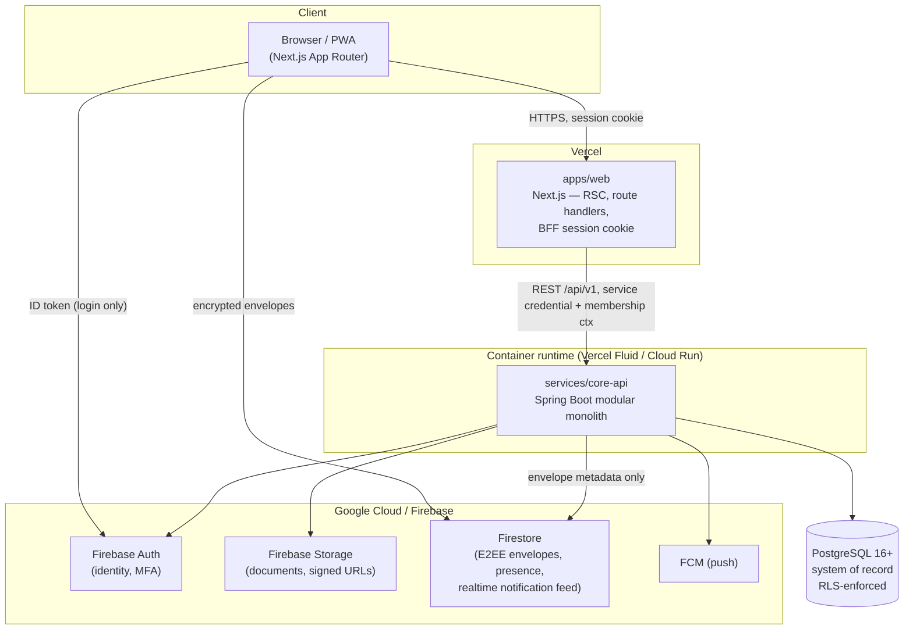
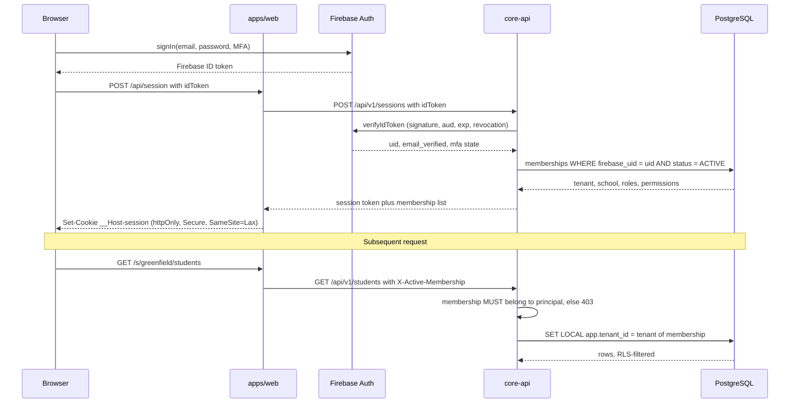

# Architecture

> **Product:** Sankofa School Platform — multi-tenant School Management System / School ERP.
> **Status:** living document. Changes to anything under "Invariants" require an ADR in `docs/adr/`.

---

## 1. System shape



### Responsibility split

| Concern | Owner | Rationale |
|---|---|---|
| Transactional system of record | **PostgreSQL** | Relational integrity, ACID, double-entry accounting, RLS tenant isolation |
| Identity and credentials | **Firebase Auth** | MFA, recovery, session revocation, federation — we never store passwords |
| Authorization (roles/permissions) | **PostgreSQL** | Authoritative. Custom claims are a *cache*, never the source of truth (§13) |
| Binary documents | **Firebase Storage** | Private bucket, short-lived signed URLs only |
| E2EE chat envelopes, presence | **Firestore** | Realtime fan-out; server never holds plaintext (see `E2EE_CHAT.md`) |
| Push delivery | **FCM** | — |
| Business logic, money, grading, payroll | **services/core-api (Java)** | Auditable, typed, transactional |
| Rendering, navigation, forms | **apps/web (Next.js)** | — |

**Firestore is never the system of record for a business entity. Money never touches Firestore.**

---

## 2. Invariants

These are load-bearing. Violating one is a release-blocking defect.

### I-1 Tenant isolation is enforced twice

Every tenant-owned table carries `tenant_id uuid not null`. Isolation is enforced by
**(a)** PostgreSQL Row-Level Security keyed on `current_setting('app.tenant_id')`, and
**(b)** application-layer scoping in the repository.

Neither may be the only control. The tenant is resolved **from the authenticated principal's
membership** — never from a request header, body, query parameter, or subdomain alone (§7, §77).

### I-2 Money is decimal and carries its currency

`numeric(19,4)` in PostgreSQL, `BigDecimal` in Java, `string` over the wire. No `double`, no
`float`, no JavaScript `number` for an amount — ever. Every monetary column is accompanied by a
`currency char(3)` ISO-4217 column, or inherits one from an explicitly documented parent row.

### I-3 Posted financial records are immutable

A journal in state `POSTED` can never be updated or deleted. Correction is by **reversal** or by an
**adjusting journal** that references the original. Enforced by a database trigger, not only by
service code.

### I-4 Every posted journal balances

`sum(debit) = sum(credit)` per journal, in the journal's currency. Enforced by a deferred
constraint trigger evaluated at commit.

### I-5 Published academic results are protected

After `PUBLISHED`, a mark changes only through an amendment record capturing
`old_value, new_value, reason, changed_by, approved_by, occurred_at`.

### I-6 Statutory and pricing rules are effective-dated

Tax rates, PAYE bands, pension rates, fee structures, salary structures and account mappings carry
`effective_from` / `effective_to`. Historical documents resolve the rule that was in force at the
time, never today's rule (§140, §141).

### I-7 Timestamps are UTC

`timestamptz` in PostgreSQL, `Instant` / `OffsetDateTime` in Java, rendered in the tenant's timezone
at the edge. Calendar-only values (date of birth, school day, due date) use `date`.

### I-8 No silent failure

A failed payroll posting, SMS dispatch, payment verification or result publication is recorded as
failed and surfaced. Never swallowed to keep a screen looking successful (§185).

---

## 3. Backend module structure

`services/core-api` is a **modular monolith**, not microservices (§6). Modules are Java packages
under `io.sankofa.school` with boundaries enforced in CI.

```
io.sankofa.school
├── platform/        cross-cutting: config, errors, ids, money, time, outbox, jobs, paging
├── tenancy/         tenant resolution, RLS context, tenant registry
├── identity/        users, roles, permissions, memberships, sessions
├── school/          school, campus, branding, academic year, term, calendar
├── subscription/    plans, entitlements, limits, lifecycle
├── admissions/      applications, offers, enrolment conversion
├── students/        student, enrolment history, promotion
├── guardians/       guardian, student-guardian links, portal access
├── academics/       levels, classes, streams, subjects, teaching assignments
├── attendance/      daily and period attendance, corrections
├── timetable/       periods, allocations, clash detection, substitution
├── assessments/     assessment types, weights, marks
├── grading/         grading schemes, computation, ranking
├── reporting/       report cards, transcripts, document versioning
├── finance/         fee structures, invoices, payments, receipts, refunds
├── accounting/      chart of accounts, journals, ledger, periods, reports
├── tax/             effective-dated tax rules and computation
├── hr/              staff, contracts, leave, performance, documents
├── payroll/         pay periods, salary structures, runs, payslips
├── library/         catalogue, copies, loans, reservations, fines
├── inventory/       items, stores, stock movements, valuation
├── procurement/     requisitions, purchase orders, goods receipt, supplier bills
├── assets/          asset register, custody, depreciation, disposal
├── transport/       vehicles, routes, stops, assignments
├── hostel/          blocks, rooms, beds, allocations
├── health/          infirmary visits, alerts (restricted)
├── discipline/      incidents, sanctions (restricted)
├── documents/       upload, scan hook, signed access
├── communications/  notification service, templates, channels, provider adapters
├── messaging/       E2EE device registry and envelope metadata
├── audit/           audit log, reasons, support access
├── analytics/       deterministic metric services and read models
└── integrations/    API keys, webhooks, external adapters
```

**Dependency rule.** `platform` and `tenancy` may be imported by anything; they import nothing back.
Domain modules depend downward on those shared kernels and communicate **sideways only via the
outbox** (`platform.outbox`) — never by reaching into another module's repositories. Cross-module
reads go through a published `*Facade` interface owned by the source module. Enforced by ArchUnit
in `ModuleBoundaryTest`.

---

## 4. Tenant resolution



The subdomain (`greenfield.sankofa.school`) is a **routing hint for UX only**. The effective tenant
is the tenant of the *verified membership*. A mismatch between subdomain and membership is a 403,
not a silent switch.

---

## 5. Database conventions

| Rule | Value |
|---|---|
| Engine | PostgreSQL 16+ |
| Migrations | Flyway, `services/core-api/src/main/resources/db/migration` |
| Migration naming | `V{NNNN}__{snake_case_description}.sql`, 4 digits, monotonic, never edited once merged |
| Schemas | one per bounded context: `platform`, `identity`, `school`, `academics`, `finance`, `accounting`, `hr`, `payroll`, ... |
| Primary keys | `uuid` (UUIDv7, time-ordered), generated application-side |
| Human references | separate column, e.g. `student_no text` holding `STU-2026-000123`, allocated by a concurrency-safe sequence service |
| Tenant column | `tenant_id uuid not null references platform.tenant(id)` on every tenant-owned table |
| Audit columns | `created_at timestamptz not null default now()`, `created_by uuid`, `updated_at timestamptz`, `updated_by uuid`, `version bigint not null default 0` |
| Money | `numeric(19,4)` plus `currency char(3)` |
| Enumerations | `text` plus `check` constraint, not native enums, which are painful to evolve |
| Soft delete | not a global pattern; use explicit lifecycle status columns. Financial rows are never deleted (§82) |
| Naming | `snake_case`, singular table names, `fk_` `uq_` `ix_` `ck_` constraint prefixes |
| RLS | every tenant-owned table gets `ENABLE` plus `FORCE ROW LEVEL SECURITY` and a policy on `app.tenant_id` |

### RLS pattern applied to every tenant-owned table

```sql
ALTER TABLE academics.class_group ENABLE ROW LEVEL SECURITY;
ALTER TABLE academics.class_group FORCE  ROW LEVEL SECURITY;

CREATE POLICY tenant_isolation ON academics.class_group
    USING      (tenant_id = platform.current_tenant_id())
    WITH CHECK (tenant_id = platform.current_tenant_id());
```

`platform.current_tenant_id()` reads `current_setting('app.tenant_id', true)` and **raises** when it
is unset, so an unscoped query fails loudly instead of quietly returning every tenant's rows.

`FORCE` matters: without it, the table owner bypasses its own policy. A separate migration role
bypasses RLS; the runtime application role never does.

---

## 6. Request lifecycle in core-api

```
HTTP
 -> SecurityFilterChain             authn: verify session, load principal
 -> TenantContextFilter             resolve membership, bind TenantContext, SET LOCAL app.tenant_id
 -> @RequiresPermission             authz: granular permission check (§12)
 -> Controller                      DTO in, Bean Validation
 -> ApplicationService              @Transactional boundary, orchestration
 -> DomainService                   pure business rules, no framework types
 -> Repository                      Spring Data JDBC; tenant predicate always present
 -> PostgreSQL                      RLS as the second line of defence
      |
      +- Outbox row written in the SAME transaction
             |
             +- OutboxPoller -> NotificationService / Analytics / Integrations
```

`GlobalExceptionHandler` maps every exception to the canonical error shape (§106). Stack traces
never leave the process.

---

## 7. Frontend structure

```
apps/web/src
├── app/
│   ├── (public)/                 marketing, public admissions application, password reset
│   ├── (auth)/                   sign-in, MFA, recovery
│   ├── (platform)/               Platform Super Admin workspace
│   └── (school)/[school]/        tenant workspace
│       ├── (admin)/              school admin and settings
│       ├── (head)/               headmaster executive dashboards
│       ├── (teacher)/            teacher daily workflow
│       ├── (bursar)/             finance, fees, accounting
│       ├── (hr)/                 HR and payroll
│       ├── (parent)/             guardian portal, mobile-first
│       └── (student)/            student portal
├── components/                   feature components
├── server/                       server-only: session, API client, permission helpers
└── lib/                          formatting, money, dates, chart adapters
```

Server Components by default. `"use client"` only for genuine interactivity — forms, charts, tables
with local state. Data reaches the client already authorized: the web tier never *decides*
permissions, it only *hides* what the API would refuse anyway (§98).

---

## 8. Cross-cutting decisions

| Area | Decision | ADR |
|---|---|---|
| System of record | PostgreSQL, not Firestore | [0001](adr/0001-postgresql-as-system-of-record.md) |
| Backend language | Java 21 LTS with Spring Boot | [0002](adr/0002-java-spring-boot-core-api.md) |
| Tenant isolation | RLS plus application layer, dual enforcement | [0003](adr/0003-tenant-isolation-strategy.md) |
| Identity | Firebase Auth, database-authoritative authorization | [0004](adr/0004-firebase-auth-with-db-authorization.md) |
| Accounting | Immutable posted journals, reversal-only correction | [0005](adr/0005-accounting-immutability.md) |
| Notifications | Central service plus transactional outbox | [0006](adr/0006-notification-architecture.md) |
| E2EE chat | Audited library, server holds no plaintext | [0007](adr/0007-e2ee-messaging-protocol.md) |
| Monorepo tooling | npm workspaces | [0008](adr/0008-monorepo-tooling.md) |
| Identifiers | UUIDv7 internally, human reference codes separately | [0009](adr/0009-identifier-strategy.md) |
| Money | `numeric(19,4)` and `BigDecimal` | [0010](adr/0010-money-representation.md) |
| Effective-dating | statutory and pricing rules versioned in time | [0011](adr/0011-effective-dated-configuration.md) |
| Test database | zonky embedded PostgreSQL, no Docker requirement | [0012](adr/0012-testing-database-strategy.md) |

---

## 9. What this architecture deliberately does not do

- **No microservices.** One deployable backend with hard internal seams. Splitting later stays
  available because the boundaries exist; it is not a cost paid today.
- **No AI or ML anywhere.** Every number on every dashboard traces to a SQL query over real rows.
  No inference, no recommendation, no generative text (§1).
- **No ORM lazy-loading object graph.** Spring Data JDBC with explicit aggregates rather than JPA
  entity graphs, so query shape stays predictable and tenant predicates stay visible.
- **No client-trusted state.** Role, tenant, price, balance, grade and approval status are always
  recomputed server-side (§77).
