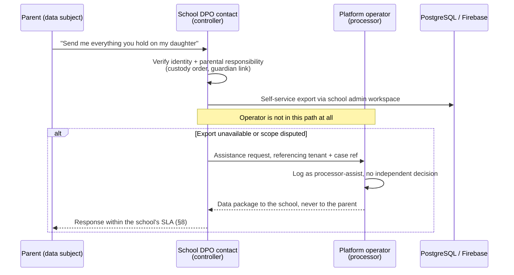
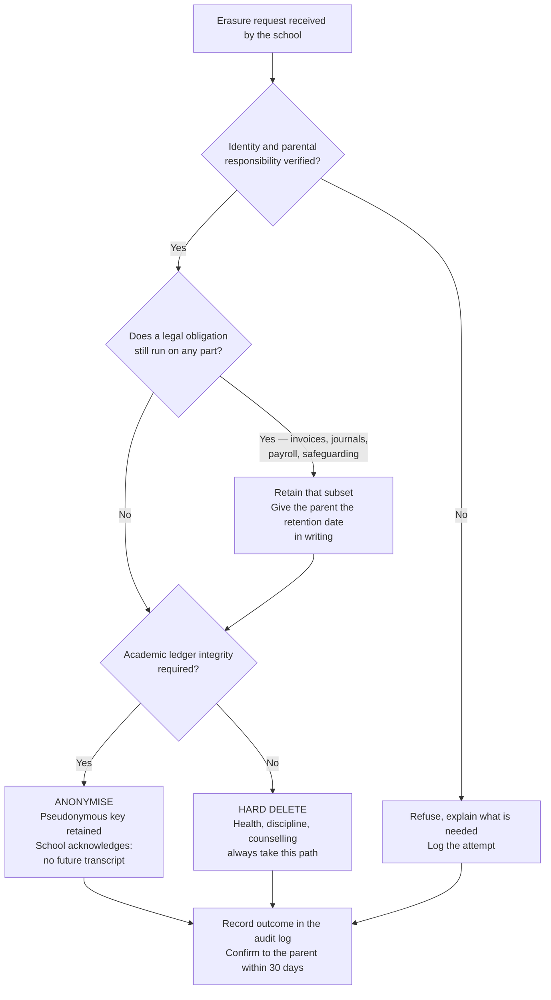

# Data Privacy

> ### ⚠ Partly out of date — read this first
>
> This document was written for the previous architecture: a Java/Spring Boot API, Firebase
> Authentication, Firestore and Flyway. That stack was retired on 2026-09-19; see
> [ADR 0010](adr/0010-nextjs-fullstack-on-vercel.md) for what replaced it and what was lost.
>
> **The legal obligations, the retention schedules and the data classification are unaffected by a change of framework and still apply in full. The storage and access mechanisms named here have changed.**
>
> It has not been rewritten yet, and rewriting it is tracked in
> [IMPLEMENTATION_STATUS.md](../IMPLEMENTATION_STATUS.md). Nothing here has been silently
> corrected, because a half-updated security document is more dangerous than an obviously stale
> one — you cannot tell which half you are reading.

---

> **What this is for:** the rules that decide what personal data the Sankofa School Platform may
> hold, who may see which field, how long it survives and how it leaves. **Who reads it:** an
> engineer about to add a column or a screen, and a school's data protection point of contact who
> has to answer a parent.

This document is normative for schema and feature decisions. Where it conflicts with convenience,
convenience loses. Changes to the retention table (§7) or the visibility matrix (§4) require an ADR.

---

## 0. What exists today

Be honest with yourself before you quote this document at a customer. As of the last update, the
schema consists of `V0001__platform_core.sql` and `V0002__identity_rbac.sql`. Everything below is
marked so you can tell a control that runs from a control that is written down.

| Control | Status | Where |
|---|---|---|
| Tenant isolation, RLS + app layer | **Built** | `platform.current_tenant_id()`, per-table `tenant_isolation` policy |
| Fail-closed on unscoped query | **Built** | `current_tenant_id()` raises `42501` when `app.tenant_id` is unset |
| No platform-admin bypass of tenant rows | **Built** | No platform predicate on tenant tables; platform reads `platform.tenant_usage` (§105) |
| Granular permissions, DENY beats ALLOW | **Built** | `identity.effective_permissions()` |
| Sensitivity flags on permissions | **Built** | `identity.permission.is_sensitive`, `.is_child_sensitive` |
| Time-boxed, reasoned, school-visible support access | **Built** | `identity.support_access_grant` (§74) |
| Append-only security event log | **Built** | `identity.security_event` + `platform.forbid_mutation()` |
| Session tokens stored as SHA-256 only | **Built** | `identity.user_session.token_hash` (§85) |
| Permission catalogue seed | **Planned** — referenced as `V0003`, not written | — |
| Field-level visibility enforcement (§4) | **Planned** | needs `students`, `health`, `discipline` schemas |
| Consent records (§12) | **Planned** | no table exists |
| Retention jobs (§7) | **Planned** | `platform.job_execution` exists; no retention job does |
| Anonymisation routine (§9) | **Planned** | — |
| DSR request tracking (§8) | **Planned** | handled by email and a spreadsheet until built; say so to customers |
| Audit log (`audit` module) | **Planned** | only `identity.security_event` exists today |
| `docs/INCIDENT_RESPONSE.md` | **Planned** — not yet written | §11 points at it anyway |

---

## 1. Scope and roles

**The school is the data controller. The platform operator is the data processor.** This is not a
formality; it decides who answers the phone.

The school decides *why* a child's data is processed — it sets the fee policy, chooses to record
attendance by period, decides that the nurse keeps allergy records. The platform operator decides
only *how*, within the instructions the contract records: which database, which encryption, which
region. An operator who starts deciding *why* — mining tenant data for product analytics, say —
has become a controller for that purpose and has taken on the controller's liability. Do not do it.

Practically:

| Situation | Who answers | What the other party does |
|---|---|---|
| Parent asks "what do you hold about my child?" | The **school** | Operator supplies an export through the tenant's own admin tools; operator never answers a parent directly |
| Parent asks the school to delete a record | The **school** decides; operator executes | Operator refuses a deletion instruction that would break accounting integrity (§7, §9) and says why in writing |
| Regulator writes to the operator about a tenant | Operator **notifies the school within one business day** | School responds; operator assists |
| Operator detects a breach affecting one tenant | Operator notifies **that school** (§11) | School decides on regulator and data-subject notification |
| Support engineer needs to see a record to fix a ticket | Operator requests **time-boxed, permission-limited** access; school can see it happened | `identity.support_access_grant`, always with a reason ≥10 characters |

A parent should never be routed to the platform operator's support desk. If one reaches us, the
answer is "your school holds this data; here is the contact they gave us" — and nothing else.

---

## 2. Alignment, not certification

This platform is **aligned with** Ghana's Data Protection Act, 2012 (Act 843) and, where a school
serves EU families or an international school operates cross-border, with the GDPR. It is **not
certified** against either, and nobody on this team may write or say that it "is compliant".
Compliance is a property of a specific school's specific processing, assessed by someone qualified
to assess it — not a property of a codebase.

What that alignment means concretely:

- **Act 843's data protection principles** — accountability, lawfulness, purpose specification,
  compatibility of further processing, data quality, openness, security safeguards, and data subject
  participation — are the frame for §§3–8 below. The controls exist to make each of them
  demonstrable rather than asserted.
- **Registration with the Data Protection Commission.** Under Act 843, a data controller processing
  personal data in Ghana is expected to register with the Commission and to renew that registration
  periodically. **The school carries this obligation.** Onboarding should ask for the school's
  registration status and record it; it should not assert a status on the school's behalf.
  Whether the platform operator must also register in its own right is a question for the operator's
  counsel — many processors do. *Status: onboarding does not yet capture this field; planned.*
- **GDPR** applies where a school in scope offers services to, or monitors, individuals in the EU.
  For a Ghanaian day school with a handful of expatriate families this is usually not triggered; for
  an international school with an EU campus or EU-resident families it plainly is. The platform is
  built so the stricter reading is workable: the visibility matrix, retention table and rights
  workflow below are written to GDPR shape, because meeting the stricter standard everywhere is
  cheaper than running two behaviours.
- **Where a section says "confirm with counsel", it means it.** Retention periods, the precise
  registration obligation, and whether a given discipline record is "special personal data" are
  legal calls. Engineers implement the configured answer; they do not invent it.

One drafting note that matters: Act 843 defines **"special personal data"** to include information
on health and information relating to criminal behaviour. The GDPR splits these — health under
Article 9, criminal offence data under Article 10. The practical effect for us is the same and is
handled in §5: health, discipline and counselling get the strictest treatment in the product,
regardless of which label a given jurisdiction attaches.

---

## 3. Lawful basis by processing purpose

Pick the basis *before* you build the feature, because the basis decides whether there is a
withdrawal button. **Status: planned** — no purpose registry table exists yet; this table is the
specification for it.

| Purpose | Primary basis (GDPR framing) | Act 843 framing | Notes |
|---|---|---|---|
| Admissions / enrolment | Contract (steps prior to contract) | Performance of a contract with the data subject | Unsuccessful applicants fall to legitimate interests for the appeal window only (§7) |
| Academic records, marks, transcripts | Contract; legal obligation where a national authority requires returns | Contract / obligation imposed by law | Survives the contract — a school must be able to certify past attainment |
| Attendance | Legal obligation where mandated; otherwise legitimate interests (safeguarding, statutory returns) | Obligation imposed by law / legitimate interest | **Never consent.** A school cannot stop taking a register because one parent objects |
| Fees, invoicing, receipts | Contract | Contract | Payment processor is a separate sub-processor; disclose it |
| Accounting and statutory financial records | Legal obligation | Obligation imposed by law | Drives the retention conflict in §7 |
| Payroll, PAYE, SSNIT | Legal obligation; contract with the employee | Obligation imposed by law | Staff data, not student data — but the same rules apply |
| Health / infirmary | Vital interests in an emergency; **explicit consent** for ongoing care records; substantial public interest / duty of care where the law provides | Special personal data — explicit consent or a statutory ground | See §5. Get the consent at admission, record the wording version |
| Discipline | Legitimate interests (safe running of the school); legal obligation for safeguarding referrals | Legitimate interest / obligation imposed by law | Treated as special-category by internal policy even where the law does not require it |
| Counselling | **Explicit consent** of the guardian, or the student where competent; vital interests in a crisis | Special personal data | Strictest of all. Notes are not part of the academic record |
| Transport | Contract for the transport subscription; vital interests for the emergency contact carried on the bus | Contract | Stop assignment, not full home address (§4) |
| Operational messaging (attendance alert, fee reminder, closure notice) | Contract / legitimate interests | Contract / legitimate interest | Guardians cannot opt out of an "your child did not arrive" message. Say so in the notice |
| **Marketing to parents** | **Consent**, separately captured, separately withdrawable | Consent | See below |

**Marketing needs separate treatment.** Fundraising appeals, open-day invitations for a sibling,
third-party offers, alumni communications and anything sent by a partner are marketing, and they do
not ride on the enrolment contract. They need their own consent record, their own withdrawal
control, and a suppression list the notification service checks *before* the outbox dispatches
(§12). A fee reminder is not marketing. An invitation to the school's new swimming academy is,
even when the school insists it is "just information". If in doubt: would the school still send it
to a family that had left? If yes, it is marketing.

---

## 4. Data minimisation: who sees which field (§88)

The rule this table encodes: **a role sees the fields its job needs and no more, and "needs" is
decided by the task, not by seniority.** A class teacher is trusted with a child's welfare and is
not trusted with the family's fee arrears — those are different jobs.

*Status: planned.* The permission catalogue that would enforce this is `V0003`, unwritten. Until it
exists, this table is the specification, not a description.

| Role | Sees | Deliberately hidden |
|---|---|---|
| **Subject teacher** | Roster for classes they teach: name, photo, student number, class; their own subject's marks and period attendance; a boolean medical-alert flag ("alert on file — contact the nurse") | Home address; guardian phone and email; fee balance; other subjects' marks; any class they do not teach; all medical detail; discipline detail beyond incidents they filed; counselling entirely |
| **Class teacher** | Everything a subject teacher sees for their own class, plus: full attendance, all subjects' marks (to compile the report card), guardian names and contact for their class, discipline summary for their class | **Fee balance and payment history** — the class teacher must not be the person who knows which family has not paid; medical detail beyond the alert flag; counselling notes; any other class; staff records |
| **Bursar** | Student name, number, class, enrolment status; guardian billing contact; invoices, payments, receipts, balances, fee category, scholarship and sibling-discount flags | Marks; attendance detail (aggregate term totals only, where a fee depends on it); health; discipline; counselling; teacher appraisals |
| **Nurse** | Name, photo, date of birth, class; emergency contacts; the full medical record — allergies, conditions, medication, consent to treat, visit history | Marks; fee balance; discipline detail (available only through a separately granted, audited permission when a welfare escalation requires it); payroll; any student not enrolled |
| **Transport manager** | Name, photo, class; assigned route and **stop** — not the full home address; the designated pickup guardian and their phone; emergency contact; medical alert flag as a boolean | Full residential address (admissions uses it once to assign a stop, then it is not re-exposed); marks; fees; medical detail; discipline; the guardian's other children |
| **Librarian** | Name, student number, class; loans, reservations, holds; fines **on library items only** | Tuition fee balance; marks; attendance; health; discipline; guardian contact details — a librarian triggers an overdue notice through the notification service by template, and never sees a phone number |
| **Parent / guardian** | Their own linked children only: academic record after publication, attendance, full fee ledger and receipts, transport assignment, health record, discipline record, and messages about that child | Any other child, including named class rank tables — publish a position, not a leaderboard of names; teachers' personal contact details; staff records; **the other guardian's contact details** (this matters in a custody dispute); counselling notes withheld under a documented safeguarding decision |
| **Student** | Their own record, age-gated (§6): published marks, own attendance, timetable, library loans, transport assignment | **Fee balance and arrears — hidden by default**, because a child should not be told the family owes money (a tenant may enable it for sixth-form or boarding students); medical detail below the configured age; discipline beyond a summary; counselling notes, always; guardians' contact, employment or income fields; every other student's everything |

Two things this table is trying to prevent, stated plainly so nobody re-introduces them:

1. **The convenience join.** "While I'm building the class list, I'll include the balance so the
   teacher can chase it." That single column turns a teacher into a debt collector and exposes a
   family's finances to a dozen staff. If a school wants teachers chasing fees, that is the school's
   decision to make explicitly, as a configured permission — not a default of the list endpoint.
2. **The denormalised name.** Copying `student.full_name` into the library, transport or accounting
   tables to save a join breaks §9: anonymising the student record then leaves the name behind in
   four other places. Reference a person by `uuid`. Always.

---

## 5. Special-category data: health, discipline, counselling

These three get the strictest treatment in the product. The schema hooks are built; the enforcement
is not.

**Built.** `identity.permission.is_child_sensitive` exists precisely for these records, and
`is_sensitive` excludes a permission from any "grant the whole module" convenience. Use both.

**Rules.**

- **An ordinary teacher never sees medical detail.** Not the condition, not the medication, not the
  visit note. They see a boolean alert flag and the instruction to contact the nurse. A teacher
  supervising a field trip may need more; that is a separate, time-boxed, explicitly granted
  permission with a reason recorded (§188) — not a widening of the teacher role.
- **Every read is audited, not just every write.** For ordinary data an audit entry on change is
  enough. For health, discipline and counselling, the *access* is the event worth recording: who
  opened this child's medical record, when, and from where. *Status: planned* — the `audit` module
  does not exist; `identity.security_event` is the nearest built equivalent and is append-only.
- **Counselling notes are not part of the academic record.** They are not visible to the class
  teacher, do not appear on a report card, are not included in a standard parent export, and are not
  transferred with a student to another school without a separate, documented decision.
- **A DENY grant is the tool for an exception in the other direction.**
  `identity.membership_permission_grant` with `effect = 'DENY'` beats any role-derived ALLOW, carries
  a mandatory `reason`, and can carry an `expires_at`. Use it when one individual must be excluded —
  for example a staff member who is themselves a parent at the school and must not reach their own
  child's discipline file.
- **Never log the content.** A medical note, a discipline narrative or a counselling entry must not
  reach an application log, an error message, a metric label, a notification body or an analytics
  event. The notification for an infirmary visit says "your child was seen by the nurse today,
  please contact the school", not the diagnosis.

---

## 6. Children's data

A child is a data subject with rights of their own, held largely — not entirely — by a guardian.

**Age-appropriate visibility.** The student portal is age-gated by a per-tenant configured
threshold rather than a hardcoded age, because the right line differs between a Ghanaian JHS, an
IB school and a boarding house. Below the threshold, the student sees timetable, published marks,
attendance and library loans. Above it, the school may additionally enable the student's own health
summary and their own discipline summary. Fee arrears stay off by default at every age.
*Status: planned.*

**What the student sees about themselves vs what the guardian sees.** These are not the same set,
and neither is a superset of the other:

- The guardian sees the fee ledger; the student does not.
- The student sees their own counselling appointment exists; the guardian sees it too, unless the
  counsellor has recorded a safeguarding reason to withhold it — and that withholding is a
  documented decision by the school's safeguarding lead, never a developer's default and never
  automatic.
- Neither sees the counsellor's notes through the product.
- As a student approaches majority, the balance shifts toward the student. The product should make
  that shift a configuration the school sets, not an event that surprises a family.

**The custody-change problem.** This is the case the product most often gets wrong, and it is
urgent when it happens: a guardian's access must be revoked *today*, possibly under a court order,
possibly with the other parent standing at the front desk.

Requirements:

1. Revocation is a first-class action on the student–guardian link, not a deletion of the guardian
   user. The guardian may still be linked to a sibling, and may have a payment history that must
   remain attributable.
2. Revocation is **immediate**, which means it must cut live sessions, not merely future logins.
   The built mechanism is `identity.app_user.sessions_valid_from` — advancing that instant rejects
   every outstanding session. The membership also moves to `ENDED`.
3. It must cut the **notification** path in the same transaction, or the school will keep texting a
   parent the court has just excluded. The outbox is transactional for exactly this reason: write
   the revocation and the suppression together, or neither.
4. Historic data stays. The revoked guardian's past payments, past messages and past consent
   records are not rewritten; they were true when they happened.
5. It is audited with a reason, and the school can show the audit entry to a lawyer.
6. The *other* guardian must not be able to read the revoked guardian's contact details through any
   screen — see §4. A custody dispute is precisely when an address leak causes harm.

*Status: `sessions_valid_from` and membership status are **built**; the student–guardian link,
the revocation workflow and notification suppression are **planned**.*

---

## 7. Retention

Retention periods are **tenant configuration with a platform default**, not constants in code
(AGENTS §10.3). A Ghanaian day school, an international school with an EU campus and a school
under a diocesan records policy will not agree, and they should not have to.

*Status: planned.* No retention job exists. `platform.job_execution` is built and is where a
retention run must record itself — including a partial or failed run (Invariant I-8).

| Category | Default retention | Basis | At expiry |
|---|---|---|---|
| Unsuccessful admission application | 12 months after decision | Legitimate interests — appeal window | Hard delete of applicant PII; keep a counted aggregate only |
| Student core record, enrolment history | Permanent by default | Contract, then the school's duty to certify attainment | Never auto-expires; removed only via §9 on a lawful request |
| Marks, assessments, report cards, transcripts | Permanent by default; minimum 10 years after leaving | Duty to certify past attainment | Retained against the pseudonymous key (§9) |
| Attendance, per-period rows | 7 years after end of academic year | Statutory returns, safeguarding | Aggregate to per-term totals; delete period-level rows |
| Health / infirmary records | Age of majority + 7 years, or last visit + 7 years, whichever is later | Duty of care; potential claims | Nurse and DPO review, then delete. Never a silent batch delete |
| Discipline records | End of enrolment + 3 years | Legitimate interests | Reviewed, then deleted — **except** safeguarding referrals, which follow national safeguarding guidance and are excluded from the job |
| Counselling records | Age of majority + 7 years | Professional duty of care | Manual review only. No automated deletion, ever |
| Invoices, receipts, payments, journals, ledger | 6 years after end of financial year (**confirm with the school's auditor and counsel**) | Legal obligation — Ghana's tax and companies legislation | **Not deleted.** See the conflict below |
| Payroll, payslips, PAYE and SSNIT records | 6 years after end of tax year (confirm) | Legal obligation | Retained |
| Staff HR file | 6 years after contract end (confirm) | Employment claim limitation | Delete, keeping an employment-dates stub for reference requests |
| E2EE message envelopes | 24 months (tenant configurable) | Contract | Envelope and metadata deleted. The server never held plaintext |
| Notification delivery logs (SMS, email, push) | 24 months | Dispute resolution; Invariant I-8 | Recipient identifier redacted; delivery outcome counts retained |
| Audit log | 7 years, append-only | Accountability principle | Never deleted by the application; archived to cold storage |
| Session rows | 90 days after expiry | Security operations | Deleted |
| Security events (`identity.security_event`) | 2 years | Security operations | Append-only by trigger; archived, not updated |
| Uploaded documents (Firebase Storage) | Follows the record they attach to | — | Object deleted; the storage-path row is tombstoned so a dangling reference is visible, not silent |
| Backups | 35-day rolling window | Disaster recovery | See below — do not pretend otherwise |

**The conflict, stated plainly.** A parent asks for a child's data to be deleted. Some of that data
is on invoices, receipts and posted journals. Those records are held under a **legal obligation**,
and a legal obligation outranks an erasure request — under both Act 843 and GDPR Article 17(3).

**Deletion must never destroy accounting integrity (§180).** A posted journal is immutable
(Invariant I-3), financial rows are never deleted (§82), and no privacy workflow gets an exemption
from either. What we do instead is minimise around the ledger: contact details are removed from the
customer record, the person is pseudonymised (§9), and the accounting document keeps what it had
when it was issued — because a ledger you can silently edit is not a ledger. Tell the parent this,
in writing, with the retention date. A clear "we will hold the billing records until 2032 and
nothing else" is a better answer than a deletion you cannot actually perform.

**Backups.** A deletion is satisfied in the live system immediately and in backups by the expiry of
the rolling window. We do not surgically edit backups; nobody credible does. The honest statement
to a school is: live within the SLA, backups within 35 days, and no restore may reintroduce a
deleted subject without re-running the deletion. That last clause is a real engineering task, not a
sentence in a policy — a restore runbook that skips it silently undoes the deletion.

---

## 8. Data subject rights

All requests arrive at the **school**. The operator's job is to make each one executable without a
support ticket. *Status: planned* — no request-tracking table exists; until it does, schools handle
these manually and we must say so rather than implying tooling that is not there.

The SLA below is a single 30-calendar-day internal clock for every right. GDPR Article 12(3) allows
one month, extendable by two with reasons. Act 843 does not set one uniform clock across all rights
— confirm the applicable period with counsel — so we operate the stricter posture everywhere rather
than maintaining two behaviours.

| Right | Operational workflow | SLA | Traps |
|---|---|---|---|
| **Access** | School verifies identity and parental responsibility, then runs the self-service export for the child | Acknowledge 2 business days; deliver within 30 calendar days | The export must not include *another* child's data — class rank tables and group message threads are the usual leak |
| **Correction** | Edit through the ordinary screens; the audit entry carries old value, new value, reason, actor | 30 days; same day for a safeguarding-critical field such as an allergy | A published mark is corrected by **amendment**, never by overwrite (Invariant I-5) |
| **Export / portability** | Structured, machine-readable export: JSON plus PDF report cards. Scope is the child, not the household | 30 days | Portability applies to data provided under contract or consent — not to the school's own assessments of the child. Do not over-deliver by reflex |
| **Deletion / erasure** | Routed through §9. School decides; operator executes or refuses in writing with the legal basis for refusing | 30 days, or a dated statement of what is retained and until when | Statutory financial retention wins. Anonymisation is usually the right answer, and it is irreversible |
| **Objection** | Recorded against the purpose, not the person. A marketing objection is absolute; an objection to attendance processing is not | 30 days | If you would refuse to honour the objection, the basis was never legitimate interests — revisit §3 |
| **Withdraw consent** | One control per consent purpose, effective before the next dispatch, checked by the notification service at send time | Immediate; next dispatch at the latest | Withdrawal is not deletion. It stops future processing and leaves the record of what was already done |

Identity verification is the step teams skip and regret. "A parent emailed asking for the file" is
how data is handed to the wrong parent during a custody dispute. The school verifies identity *and*
parental responsibility before anything leaves.

---

## 9. Anonymisation vs deletion

For a student record we **anonymise by default and hard-delete the sensitive subsets**. The academic
ledger keeps a pseudonymous key so that a cohort's marks, a class average and an audit trail all
remain internally consistent without naming anyone.

*Status: planned.* Field-by-field specification for the routine:

| Field | Action | Why |
|---|---|---|
| `id` (uuid) | **Retained** | Becomes the pseudonymous key; every other module already references it |
| `student_no` | Retained | Printed on historic invoices and transcripts; removing it orphans those documents |
| Given / middle / family name | Replaced with `Withdrawn student STU-2026-000123` | Removes identity, keeps rows readable in a support session |
| Preferred name, photo | Deleted; Storage object deleted, path row tombstoned | — |
| Date of birth | Truncated to year | Keeps age-band statistics valid without identifying |
| Sex, nationality, home language | Retained as coded values, or nulled per tenant policy | Statistical use; low re-identification value alone, high in combination — a small cohort can be re-identified from three coded fields. Tenant policy decides |
| Address, GPS digital address | Deleted | — |
| Phone, email | Deleted | — |
| National ID / Ghana Card number | **Deleted, not hashed** | A hash over a short, structured identifier space is reversible by brute force in minutes. Keeping the hash keeps the identifier |
| Guardian links | Unlinked; each guardian left with no remaining links is separately assessed | A guardian is a data subject in their own right, with their own siblings and payment history |
| Health, discipline, counselling records | **Deleted in full**, not anonymised — unless a retention basis in §7 is still running | Anonymised medical text is rarely anonymous |
| Marks, assessments, attendance aggregates | **Retained** against the pseudonymous key | The academic ledger and every cohort statistic depend on it |
| Rendered report-card and transcript PDFs | Deleted | The artifact carries the name in the pixels; the underlying marks stay |
| Invoices, receipts, payments, journals | **Untouched** | Legal obligation; Invariant I-3; §180 |
| Audit log entries | **Untouched** | Append-only by trigger, and see below |

**Why the audit log needs no rewriting.** Every module references a person by `uuid` and never
denormalises a name. Remove the name at its single source and every downstream reference becomes
pseudonymous on its own — the audit log, the outbox payloads, the job records, all of it. This is
the payoff for the join you did not take a shortcut around, and it is why §4 forbids the
denormalised name.

**The trade-off the school must acknowledge in writing before the routine runs:** once a student
record is anonymised, **the school can no longer issue that student a transcript**. The marks
survive; the link from marks to a named human does not. An alumnus writing in four years for a
university application will be told no. Anonymisation is irreversible by construction — if it were
reversible it would not be anonymisation — so the workflow requires an explicit, recorded
acknowledgement from the school before it executes, and the acknowledgement is retained.

---

## 10. Cross-border transfer

The system of record is PostgreSQL and its region is ours to choose. Firebase is not entirely.

| Component | Data | Region control | Status |
|---|---|---|---|
| PostgreSQL | Everything transactional: students, marks, money, payroll | Full — choose the region closest to the tenant population and pin it | **Planned decision.** Not yet made; make it before the first production tenant |
| Firebase Auth | Email, phone, UID, MFA enrolment | **Limited.** Standard Firebase Auth does not offer general-purpose region selection; assume identity records leave Ghana | Verify against current Google documentation before launch — do not take this sentence as current fact |
| Cloud Firestore | E2EE envelopes, presence, notification feed | Chosen at database creation and **immutable afterwards** | One-time irreversible decision; not yet made |
| Cloud Storage for Firebase | Documents, photos, report-card PDFs | Chosen per bucket at creation | Not yet made |
| FCM | Push tokens, message payloads | None meaningfully | Keep payloads content-free: "you have a new message", never the message |

What follows from that:

- Act 843 binds the school for data it sends abroad through the security-safeguards and
  accountability principles; it does not operate a GDPR-style adequacy list. The practical
  obligation is that the school knows where its data is and has a contract covering it. Confirm the
  precise transfer requirements with counsel.
- Where GDPR applies, transfers out of the EEA need an Article 46 mechanism — Standard Contractual
  Clauses with the cloud provider, plus a transfer risk assessment. Google Cloud offers SCCs; the
  operator signs them and the school needs a copy.
- The **sub-processor list** is part of the school's contract. Adding a payment provider, an SMS
  gateway or an analytics vendor changes it, and schools get notice before it changes — not after.
  *Status: planned.* No sub-processor register exists in the repo.
- Region choice for Firestore and Storage is made **once**. Getting it wrong means a migration, not
  a settings change. Decide it with the first international tenant's counsel in the room.

---

## 11. Breach handling

**Definition.** A personal data breach is any accidental or unlawful destruction, loss, alteration,
unauthorised disclosure of, or access to personal data. Act 843 frames it as unauthorised access to
or acquisition of personal data. A cross-tenant leak is a breach. A misdirected report card is a
breach. A laptop with an export on it is a breach. "No evidence it was accessed" is not "no breach";
it is one input to the risk assessment.

**Posture.** We operate to a **72-hour clock** from becoming aware, measured against the GDPR
Article 33 standard, because it is the strictest clock we might face. Act 843 requires notification
as soon as reasonably practicable after discovery rather than fixing a uniform 72-hour deadline —
running one internal clock at the stricter setting is simpler than running two.

**Who decides.** The controller does. The platform operator, as processor, **does not decide whether
to notify a regulator or the affected families** — it notifies the affected school without undue
delay, with what is known and what is not yet known, and assists. The school's decision is the
school's to make and to record.

Internal sequence:

1. Anyone who suspects a breach raises it immediately. No triage-before-raising. A false alarm costs
   an hour; a delayed alarm costs the 72 hours.
2. An incident commander is assigned and owns the clock.
3. Containment first — revoke sessions (`sessions_valid_from`), rotate credentials, disable the path.
4. Scope: which tenants, which data categories, how many subjects, special-category data yes or no.
5. Affected schools notified **within 24 hours of confirmation**, so the school still has most of the
   72-hour window for its own decision.
6. Written follow-up as facts firm up. Never a silent correction of an earlier number.

Full procedure, roles and contact tree live in **`docs/INCIDENT_RESPONSE.md`** — *Status: planned,
not yet written.* Until it exists, this section is the whole of the procedure, which is not enough;
writing it is a prerequisite for the first production tenant.

---

## 12. Consent records

*Status: planned.* No consent table exists. The specification, so it gets built once and correctly:

Store, per consent, the **tenant, the data subject, the purpose code, the decision, the moment, the
channel, who captured it, and the version of the notice text that was shown**. That last field is
the one teams forget and the one that matters: a boolean `marketing_ok = true` proves nothing two
years later, because nobody can say what the parent was actually agreeing to. Store the notice
version, keep the versions immutable, and a consent record becomes evidence rather than an assertion.

Withdrawal is an **append**, not an update: a new row with the withdrawal decision and its timestamp.
The history of what was consented to, and when it stopped, is itself the record.

Where consent is **genuinely** the basis:

- Photography and media use — website, social media, prospectus, and each of those separately,
  because a parent may agree to the yearbook and not to Facebook
- Marketing and fundraising to parents (§3)
- Optional third-party integrations a family opts into
- Alumni association data sharing
- Non-essential analytics
- Medical treatment beyond first aid
- Voluntarily supplied religious or dietary detail

Where consent is **not** the basis, and asking for it is an error:

- Attendance, marks, timetabling, fee invoicing, statutory returns, payroll, safeguarding referrals,
  and operational messaging about a family's own child.

**The test.** If a parent withdrew and you would not stop, consent was never your basis — you had a
contract or a legal obligation and you disguised it as a choice. That disguise is worse than no
consent screen at all: it misleads the parent, and it hands them a withdrawal that the school will
then refuse to honour. Name the real basis in the privacy notice and let the parent object through
§8 instead.

---

## 13. Engineer's checklist before adding a field

Run this before you write the migration, not during review.

1. **What is the purpose, and which lawful basis in §3 covers it?** If the answer is "consent" and
   there is no withdrawal control, stop.
2. **Is it a person's data at all?** Aggregate counters are cheaper to hold than rows. `platform.tenant_usage`
   exists because platform billing does not need to read a single student.
3. **Could you do the job without it?** A date of birth where an age band would do; a full address
   where a bus stop would do; a national ID where an internal `student_no` would do.
4. **Is it special-category (§5)?** If health, discipline or counselling, the permission gets
   `is_child_sensitive = true`, reads are audited, and a teacher role does not receive it.
5. **Which roles in §4 see it?** Write the row into that table in the same pull request. A field with
   no entry in the visibility matrix has a default of "nobody", not "everybody".
6. **Are you denormalising a name, phone or address from another module?** Don't. Reference by
   `uuid`. §9 depends on there being one place to remove it from.
7. **What is the retention period, and which §7 row covers it?** New category means a new row in the
   table and a decision about what happens at expiry.
8. **What happens on anonymisation?** Deleted, truncated, retained, or tombstoned — decide now and
   add it to §9. "We'll work it out later" means the routine will silently leave it behind.
9. **Does it leak through a log, an error, a metric label, a notification body or an export?**
   Check the notification template and the CSV export specifically; they are where fields escape.
10. **Does it cross a border?** If it lands in Firestore or Storage rather than PostgreSQL, §10
    applies and the region is already fixed.
11. **Is it money?** `numeric(19,4)` with a `currency char(3)`, `BigDecimal` in Java, `string` over
    the wire. Invariant I-2, and no privacy workflow ever deletes it (§180).
12. **Is it a timestamp?** `timestamptz`, UTC, Invariant I-7. A calendar-only value — date of birth,
    school day, due date — is a `date`.
13. **Does the table carry `tenant_id`, the audit columns, RLS enabled *and forced*, and the
    `tenant_isolation` policy — in the same migration that creates it?** Invariant I-1. There is no
    second pass.
