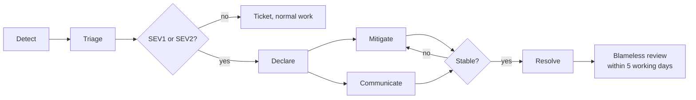

# Incident Response

**What this is for:** the procedure to follow when something is wrong in production on the
Sankofa School Platform, from detection to the written review. **Who reads it:** whoever is on
call, and whoever they wake up.

> Reading this at 02:00? Go to [§1 Severity](#1-severity), decide the level, then go straight to
> the [playbook](#5-playbooks) that matches. Sections 6 and 7 are for after the bleeding stops.

---

## 0. What exists today

This runbook is written ahead of most of the systems it describes, so the first incident is not
also the first time anyone reads a procedure. The gap matters more than a tidy document:

| Capability | State |
|---|---|
| `platform` and `identity` schemas, RLS `ENABLE` + `FORCE` on every tenant-owned table | Built — `V0001`, `V0002` |
| `platform.current_tenant_id()` raising `42501` when the tenant is unset | Built — `V0001` |
| `identity.security_event`, append-only via `platform.forbid_mutation()` | Built — `V0002` |
| `identity.user_session`, `identity.app_user.sessions_valid_from` (session cut-off) | Built — `V0002` |
| `identity.support_access_grant` — time-boxed, reasoned, permission-limited | Built — `V0002` |
| `platform.outbox`, `platform.job_execution` | Built — `V0001` |
| `audit` module (audit log, reasons, support access trail) | **Status: planned** |
| `finance`, `accounting`, `payroll`, `documents` schemas | **Status: planned** |
| `services/core-api` and `apps/web` application code | **Status: planned** — the repository holds migrations and docs only |
| Alerting, paging rota, status page, log aggregation, correlation-id search | **Status: planned** |
| `scripts/` operational tooling | **Status: planned** — the directory is empty |

Anything marked **Status: planned** is the intended procedure, not a control you can exercise
today. Where a planned control is load-bearing, the playbook says what to do without it.

---

## 1. Severity

Severity is about **impact and reversibility**, not about how interesting the bug is. If two
people are arguing between two levels, it is the higher one.

| Level | Meaning | Concrete examples in this system | Response |
|---|---|---|---|
| **SEV1** | Confirmed or credible cross-tenant exposure; money moved wrongly; total outage; data loss with no known recovery path; an attacker holding privileged access | A bursar at School A sees School B's invoices. A payment provider webhook posts a receipt against the wrong tenant. `platform.current_tenant_id()` stops raising and queries run unscoped. A CI token is used to drop a schema. Sign-in is down platform-wide. | Page now, any hour. IC named within 15 minutes. Schools told within 60 minutes. |
| **SEV2** | One tenant down, or one critical workflow broken for everyone, with a contained and reversible data impact | One school's sign-in fails while others work. Fee payment capture fails platform-wide on the first day of term. Result publication fails on publication day. The outbox stops draining so no SMS or email leaves. | Page during 06:00–20:00 UTC, IC within 30 minutes. Schools told within 4 hours. |
| **SEV3** | Degraded, with a workaround; no data integrity risk | Report card PDF generation is slow. A nightly `platform.job_execution` row lands `PARTIAL` and the retry succeeds. One notification channel is failing while another delivers. | Next business day. Ticket, no page. |
| **SEV4** | Cosmetic or single-user; no workflow blocked | A label is wrong. A filter loses its state on reload. | Normal backlog. |

**Standing rule, no exceptions.** Any suspicion of cross-tenant access is **SEV1 until
disproven**, including "it was probably just a caching bug". Invariant I-1 exists because this is
the failure mode that ends a school-records business. Disproving it is a deliberate act with
evidence (see [Playbook 1](#51-suspected-cross-tenant-data-exposure)), not an assumption.

Ghana context worth holding: Africa/Accra is UTC+0 all year, so UTC timestamps in logs read the
same as local wall-clock for our first cohort of schools. Do not assume that for an international
tenant — check `platform.tenant.timezone` before telling a school when something happened.

---

## 2. Roles

Four roles. On a small team one person can hold two, but **never incident commander and subject
expert together** — the person with their hands in the database cannot also be tracking the
clock.

| Role | Does | Does not |
|---|---|---|
| **Incident commander (IC)** | Owns the incident. Sets severity, assigns roles, decides what is tried and in what order, calls the disclosure decision, declares resolution. | Debug, type commands, or write the fix. |
| **Comms lead** | Writes to schools and internal stakeholders from the templates in §6. Owns the status page. Keeps a list of who was told what, when. | Speculate on cause or promise a restoration time the IC has not given. |
| **Scribe** | Timestamped log of every observation, action and decision, in UTC, as it happens. Captures command output before it scrolls away. | Filter for relevance. Write it up later from memory. |
| **Subject expert** | Investigates and executes. Says out loud what they are about to run, before running it. | Change severity, or talk to schools. |

The IC is the first responder until someone more suitable takes over, and handover is explicit
and spoken: "I am taking IC from you." The scribe's log is the raw material for §7; without it a
review becomes a memory contest.

---

## 3. The response loop



1. **Detect.** An alert, a school's call, or a developer noticing. **Status: planned** — until
   alerting exists, detection is mostly a school telling us, which is the slowest possible path
   and is itself a risk worth naming in every review.
2. **Triage.** Two questions, in this order: *is tenant isolation intact?* and *is money
   correct?* Everything else waits ninety seconds while you answer those.
3. **Declare.** Say the words "I am declaring a SEV*n*". Open the channel, name IC, comms lead
   and scribe. An undeclared incident has no clock and no owner.
4. **Mitigate.** Stop the harm before you understand it. Disabling a feature flag, revoking a
   token, or taking one tenant to `SUSPENDED` beats a correct root cause thirty minutes later.
5. **Communicate.** First message inside the SEV target even when you know nothing — "we are
   investigating, next update at HH:MM UTC" is a complete message.
6. **Resolve.** Harm stopped, workflow verified working, no silent degradation left behind
   (Invariant I-8). Backlog items from the incident are filed before the channel closes.
7. **Review.** Blameless, within five working days, using the §7 template.

---

## 4. Declaring: the mechanics

1. Open a channel named `inc-YYYYMMDD-<short-slug>`, e.g. `inc-20260918-cross-tenant-invoice`.
2. Pin a message with: severity, IC, comms lead, scribe, one-line impact, next update time.
3. Start the scribe log. Every line is `HH:MM UTC — <observation | action | decision>`.
4. Freeze deploys. **Status: planned** — until a CI pipeline exists, "freeze" means telling
   everyone in the channel to stop pushing, and confirming each person acknowledged.
5. Preserve evidence before you change anything you might want to look at later (§5.1 step 2).

---

## 5. Playbooks

### 5.1 Suspected cross-tenant data exposure

This is the highest-priority scenario in the product. Work it in order. Do not skip to
remediation because the cause looks obvious.

**Confirm (target: 20 minutes)**

1. Capture the report verbatim: which user, which membership, which screen or export, which
   record they saw that was not theirs, and the timestamp in UTC. Get a screenshot if a human
   reported it. Do not paraphrase — "they saw another school's data" is not scopeable.
2. **Preserve evidence first.** Snapshot the current database state (a PITR bookmark or a
   provider snapshot, see `DISASTER_RECOVERY.md` §5) and copy the relevant log window to a
   separate location. Never run a corrective `UPDATE` or `DELETE` before this step.
3. Check whether RLS is still enabled and forced everywhere. Any row returned is a finding:

   ```sql
   SELECT n.nspname, c.relname, c.relrowsecurity, c.relforcerowsecurity
     FROM pg_class c
     JOIN pg_namespace n ON n.oid = c.relnamespace
    WHERE n.nspname IN ('platform','identity')
      AND c.relkind = 'r'
      AND (NOT c.relrowsecurity OR NOT c.relforcerowsecurity);
   ```

4. Check the runtime role has not gained a bypass. `rolsuper` or `rolbypassrls` true on the
   application role is a SEV1 on its own, whether or not anyone exploited it:

   ```sql
   SELECT rolname, rolsuper, rolbypassrls, rolcanlogin FROM pg_roles
    WHERE rolname IN ('<appRole>', '<migrateRole>');
   ```

5. Reproduce the isolation guarantee empirically, as the application role, with a known pair of
   tenants. Both assertions must hold:

   ```sql
   BEGIN;
   SET LOCAL ROLE "<appRole>";
   SET LOCAL app.tenant_id = '<TENANT_A>';
   -- must return 0
   SELECT count(*) FROM identity.membership WHERE tenant_id = '<TENANT_B>';
   ROLLBACK;

   BEGIN;
   SET LOCAL ROLE "<appRole>";
   -- app.tenant_id deliberately unset: must raise 42501, not return rows
   SELECT count(*) FROM platform.reference_sequence;
   ROLLBACK;
   ```

6. If both hold, the database boundary is intact and the leak is above it: an application-layer
   query missing its tenant predicate, a cached response served across tenants, a signed URL
   handed to the wrong person, an export job running with the wrong context, or a membership
   wrongly attached to a tenant. Check `identity.membership` for the reporting user before
   assuming a code bug — a mis-provisioned membership is *authorized* access to the wrong
   tenant, which is a different problem with the same symptom.

**Scope (target: 2 hours)**

7. Establish the exposure window: when could this first have occurred? Anchor it to a deploy, a
   migration, or a configuration change, and say which. If you cannot anchor it, the window
   starts at the earliest point the suspect code path existed.
8. Enumerate the affected tenants and the categories of data. Record the tenant list explicitly
   — a disclosure decision cannot be made against "possibly several schools".
9. Determine whether anyone actually *read* the data, as distinct from whether they *could*
   have. These are different disclosures and the distinction is worth the work.
10. **Status: planned** — the `audit` module is the intended source for step 9. Until it exists,
    the evidence available is `identity.security_event`, `identity.user_session`,
    `platform.job_execution` and application logs. Say so plainly in the review rather than
    implying better evidence than we have:

    ```sql
    SELECT occurred_at, event_type, severity, user_id, tenant_id, ip_address, correlation_id
      FROM identity.security_event
     WHERE occurred_at >= '<window start>'
     ORDER BY occurred_at;
    ```

11. Whether child-sensitive data is in scope changes everything about the response. Health,
    discipline and counselling records carry `identity.permission.is_child_sensitive`; if any
    exposed data falls in those categories, the IC escalates to the platform owner immediately
    and the disclosure timeline tightens.

**Contain**

12. Prefer the narrowest control that stops the harm: revoke the specific session
    (`identity.user_session.revoked_at`), advance `identity.app_user.sessions_valid_from` to cut
    every session for a user, disable the feature flag, or take the affected tenant to
    `platform.tenant.status = 'SUSPENDED'`. Suspending a school stops the bleeding and stops
    their day — the IC owns that trade-off and records the reasoning.
13. Do not "fix the data" during containment. Corrections happen after scope is known, under
    Invariant I-3 rules where money is involved.

**Disclosure decision**

14. The IC decides *whether* to disclose; the platform owner and counsel decide *how*. The
    decision is recorded with its reasoning either way, including a decision not to disclose.

    | Question | If yes |
    |---|---|
    | Did personal data of an identifiable person leave its tenant? | Disclose to the affected schools |
    | Is any of it child-sensitive (health, discipline, counselling)? | Disclose, escalate, tighten timeline |
    | Could it have been read, but we cannot prove it was? | Disclose, stating the uncertainty as uncertainty |
    | Was it only aggregate counters with no personal data? | Usually internal; record why |

15. Our internal standard: disclosure decision within 24 hours of confirmation, affected schools
    notified within 72 hours. This is **our commitment**, not a statutory deadline we are
    quoting. Ghana's Data Protection Act 2012 (Act 843) places obligations on a data controller
    where personal data has been accessed by an unauthorised person, and international tenants
    may bring other regimes into play. This runbook is aligned with those obligations; it is not
    legal advice and it is not a claim of compliance. Counsel confirms the statutory position
    for the specific incident, and the clock on our internal standard runs while they do.
16. Use the data-exposure template in §6.2 — not the general outage template. A school being told
    its records were exposed needs different information from a school being told the site is
    slow.

### 5.2 Compromised privileged account

1. Cut the sessions before anything else. This is the one place where speed beats investigation:

   ```sql
   UPDATE identity.app_user SET sessions_valid_from = now() WHERE id = '<USER_ID>';
   UPDATE identity.user_session
      SET revoked_at = now(), revoked_reason = 'incident <ID>: suspected compromise'
    WHERE user_id = '<USER_ID>' AND revoked_at IS NULL;
   ```

2. Disable the account in Firebase Auth so a new session cannot be minted, then set
   `identity.app_user.status = 'DISABLED'`. Both, in that order — Firebase owns credentials, our
   table owns authorization, and leaving either one open leaves a door.
3. Establish what the account could reach: roles via `identity.membership_role`, overrides via
   `identity.membership_permission_grant`, and the resolved set per membership:

   ```sql
   SELECT m.id AS membership_id, m.tenant_id, e.code
     FROM identity.membership m
     CROSS JOIN LATERAL identity.effective_permissions(m.id) e
    WHERE m.user_id = '<USER_ID>'
    ORDER BY m.tenant_id, e.code;
   ```

4. Review what changed while the account was compromised: role grants, permission overrides,
   support access grants, exports, and any financial posting. Treat every privileged action in
   the window as suspect until individually confirmed.
5. Check for persistence the attacker may have left: new memberships, new roles, `ALLOW` grants
   in `identity.membership_permission_grant`, API keys (**Status: planned** — `integrations`
   module), and new `identity.support_access_grant` rows.
6. Restore access through a fresh credential and re-enrolled MFA. Never reuse the old one.
7. Notify the account holder's school. Someone at that school needs to know their head teacher's
   account was used, whatever the outcome.

### 5.3 Leaked credential or service-account key

**The rotation order is the whole playbook.** Getting it wrong either locks you out mid-incident
or lets the attacker re-mint what you just revoked.

1. Identify what the credential is and what it can reach. Write the blast radius down before
   touching anything.
2. **Rotate minters before minted.** If the leaked credential can issue or read other
   credentials — a service account with token-creator rights, a secret-store reader, a CI
   secret — rotate *that* first. Revoking a downstream key while the attacker still holds the
   thing that mints keys accomplishes nothing.
3. For each credential, prefer **create-new → deploy-new → verify → revoke-old**. Revoking first
   causes an outage and adds a second incident on top of the one you have. Only revoke first
   when the credential is actively being abused.
4. Order for this platform, highest blast radius first:
   1. Secret store / cloud IAM credentials that can mint others
   2. Firebase service-account key (can mint tokens for any user → full impersonation)
   3. PostgreSQL `<migrateRole>` (owns schemas, has `BYPASSRLS` — no RLS protection applies)
   4. PostgreSQL `<appRole>`
   5. Payment provider API keys and webhook signing secrets
   6. SMS and email provider credentials
   7. CI deploy tokens
5. Invalidate everything derived from the leaked credential. For Firebase specifically, a leaked
   service-account key means user sessions may have been minted by the attacker: advance
   `sessions_valid_from` for privileged users at minimum, and platform-wide if the exposure
   window is unclear.
6. Audit for use during the exposure window in every provider's own log, not only ours.
7. Find how it leaked — repository, log line, error message, screenshot, client bundle — and
   close that path. AGENTS.md §1 prohibition 5 exists precisely here. Add the detection that
   would have caught it to the review actions.

### 5.4 Payment incident

Money makes this different: the correction must itself be correct, and Invariant I-3 forbids the
obvious shortcut.

**Never** fix a payment problem by editing a posted journal. Correction is by reversal or
adjusting journal, always. **Status: planned** — `finance` and `accounting` schemas do not exist
yet, so the SQL below describes the shape of the work, not runnable queries.

*Double charge*

1. Confirm at the provider, not from our records, that two distinct charges settled.
2. Identify both receipts and the journals they posted.
3. Post a reversal for the duplicate, referencing the original journal. Never update it.
4. Initiate the refund through the provider. Record the provider reference on the reversal.
5. Verify the student's fee balance recomputes correctly, and tell the guardian directly — they
   noticed before we did, and silence reads as indifference.

*Missing payment (provider says success, we have no receipt)*

1. Get the provider reference and the exact settlement time from the school or guardian.
2. Look for the webhook delivery in our records. Three cases, with different fixes:
   webhook never arrived (provider-side or network), webhook arrived and failed signature
   verification (secret drift — check whether a rotation happened), webhook arrived and was
   processed but the receipt was written against the wrong tenant or student (a SEV1, go to §5.1).
3. Replay the webhook if the provider supports it. Idempotency protects us: the unique index on
   `platform.outbox (tenant_id, event_type, idempotency_key)` makes a duplicate event a no-op.
4. If replay is impossible, capture the payment manually with the provider reference recorded,
   and file a follow-up to find out why the webhook was lost. A manual capture without that
   follow-up is how a systematic gap hides for a term.

*Webhook storm*

1. Confirm the signatures are valid. An unsigned or badly signed storm is an attack, not a
   provider bug — drop it at the edge and go to §5.7 for the availability impact.
2. Confirm idempotency is holding: the same provider reference must not produce a second
   receipt. If it is holding, the storm is a load problem, not a correctness problem, and can be
   rate-limited at the edge.
3. If idempotency is *not* holding, stop accepting webhooks immediately. Duplicated financial
   records cost far more to unwind than replaying a queue after the fix.
4. Reconcile totals against the provider's own settlement report before declaring resolution.

### 5.5 Malicious file uploaded

**Status: planned** — the `documents` module and its scan hook do not exist yet. When they do:

1. Revoke outstanding signed URLs for the object and make it unreadable. Do not delete it — it is
   evidence, and Firebase Storage object versions are not a forensic archive.
2. Identify the uploader and their membership; identify every download of that object.
3. Assess what the file could do where it landed: a browser-executed payload served from our
   origin is materially worse than a virus-laden document a teacher would have to open locally.
4. Notify downloaders through the school. They need to act on their own machines.
5. Check the upload path's validation — MIME, size, filename, extension, bucket privacy. If the
   file got in, at least one of those was wrong or missing (AGENTS.md §6).
6. Quarantine, then delete only with the IC's explicit sign-off, after evidence is preserved.

### 5.6 Database corruption

Distinguish the two kinds before doing anything, because the responses are opposites.

*Logical corruption* — the database is healthy, the data is wrong. A bad migration, a bug, a
mis-scoped update.

1. Stop the writer. Disable the job, revert the deploy, or take the tenant to `SUSPENDED`.
2. Determine the first bad transaction time. PITR to just before it is the tool of choice; see
   `DISASTER_RECOVERY.md` and the restore-vs-fail-forward decision tree there.
3. Prefer a targeted repair over a full restore when the blast radius is small and provable, and
   when no financial records are involved. Financial rows are never deleted (§82) — correct them
   by reversal.

*Physical corruption* — page checksum failures, `pg_amcheck` errors, index corruption.

1. Do not restart the database hoping it clears. Capture the error text first.
2. Stop writes to the affected relation.
3. Assume the underlying storage is suspect. Restore to new storage rather than repairing in
   place; an index can be rebuilt, a heap page cannot be invented.
4. Involve the managed-database provider early — they can see things about the volume that we
   cannot.

### 5.7 Major outage

1. Locate the failing layer before touching anything: browser → Vercel (`apps/web`) → container
   runtime (`services/core-api`) → PostgreSQL → Firebase / provider APIs. Check each in that
   order and say out loud which one is failing.
2. If it is a provider (Vercel, Firebase, the payment gateway), confirm on their status page and
   tell the schools that within the first message. A school that knows it is not their internet
   stops calling and starts planning.
3. If it is ours, the fastest safe mitigation is usually rolling back the last deploy. Do that
   before debugging, not after. Note the migration caveat: if the bad deploy included a
   migration, rolling back the application without reversing the schema may be worse than
   staying put — check first.
4. Watch what a partial outage does to money and attendance. A fee payment that succeeded at the
   provider while our webhook handler was down becomes §5.4 tomorrow; a queued attendance
   submission that silently vanished violates Invariant I-8. Reconcile both before resolving.
5. Confirm the outbox drained after recovery; a backlog of `PENDING` rows means schools are still
   missing notifications even though the site looks fine:

   ```sql
   SELECT status, count(*), min(occurred_at) AS oldest
     FROM platform.outbox GROUP BY status ORDER BY status;
   ```

### 5.8 Ransomware or destructive action by a compromised CI token

The defining feature: the attacker holds a credential that our own automation trusts.

1. **Kill the pipeline first.** Disable the CI integration and revoke its tokens before any
   investigation. Every minute it lives, it can run again.
2. Revoke cloud credentials the pipeline held, in the §5.3 order. A CI token that can deploy can
   usually also read secrets, so assume every secret it could reach is leaked.
3. Assess destruction: dropped schemas, deleted buckets, deleted backups. **Check whether the
   backups are intact before planning any recovery around them** — an attacker who understood
   the environment went for them first. `BACKUP_RESTORE.md` specifies backups written with a
   credential that cannot delete them, precisely so this check has a good answer.
4. Restore from the most recent verified-good backup, into **new** infrastructure with new
   credentials. Do not restore into an environment the attacker has touched.
5. Rebuild the pipeline from a reviewed commit, with fresh credentials, and only after the entry
   path is understood. Restoring the pipeline before understanding the entry is how the second
   round starts.
6. Do not pay. Route any ransom contact to the platform owner and counsel; nobody else replies.
7. Treat this as a data-exposure incident in parallel — an actor with this access could have read
   as well as destroyed. Run §5.1 scoping alongside recovery, not after it.

---

## 6. Communicating with schools

Rules: say what is affected in the school's own terms, say what we are doing, give the next
update time and meet it. Never speculate on cause. Never promise a restoration time the IC has
not given. A school would rather hear "we do not know yet, next update at 14:00" than nothing.

### 6.1 Service incident (initial / update / resolved)

```text
Subject: [Sankofa] Service issue affecting <fee payments | sign-in | result publication>

Dear <School name> team,

WHAT IS HAPPENING
Since approximately <HH:MM UTC / local>, <plain description of what staff cannot do>.

WHO IS AFFECTED
<All schools | your school only | staff using X>. <State explicitly whether data is at risk:
"No school data has been lost or exposed" only if that is established — otherwise
"We are still establishing whether any data was affected.">

WHAT WE ARE DOING
<Current action in one sentence, no jargon.>

WHAT YOU CAN DO NOW
<Workaround, or "No action is needed from you.">

NEXT UPDATE
By <HH:MM local time>, whether or not there is news.

<Name>, <role>, Sankofa School Platform
```

For the resolution message add: what was affected, the exact period, what was restored, anything
the school must check on their side, and what we are changing so it does not recur. Send it even
if the incident was short — a school that was told about a problem and never told it ended
assumes it is ongoing.

### 6.2 Confirmed data exposure

Do not send this from the template above. This message is reviewed by the platform owner before
it goes out, and reviewed by counsel where §5.1 step 15 applies.

```text
Subject: [Sankofa] Important: unauthorised access to <School name> data

Dear <Head teacher name>,

I am writing to tell you about an incident affecting your school's data on the Sankofa
platform. We are telling you directly because you are entitled to know, and because you may
have obligations of your own.

WHAT HAPPENED
<Plain sequence of events. No jargon. No blame. No minimising.>

WHAT DATA WAS INVOLVED
<Specific categories and approximate record counts. If it included health, discipline or
counselling records, say so first and plainly.>

WHEN
Between <UTC window>, discovered on <date>, contained on <date>.

WHO COULD HAVE SEEN IT
<Specific, and honest about what we can and cannot prove. "We can confirm X accessed it" and
"we cannot determine whether it was accessed" are both acceptable; implying certainty we do
not have is not.>

WHAT WE HAVE DONE
<Containment and remediation, with dates.>

WHAT WE ARE DOING NEXT
<Changes, with dates. Named contact for questions.>

We are sorry. <Name>, <role>, direct line <number>.
```

---

## 7. Blameless post-incident review

Within five working days of resolution, for every SEV1 and SEV2. The IC owns scheduling it; any
attendee may call for one after a SEV3 that felt worse than its label.

**Blameless means:** no person's name appears as a cause. "The engineer forgot the tenant
predicate" is not a finding; "a tenant predicate can be omitted without the build failing" is.
People act reasonably given what they knew at the time — if the outcome was bad, the system made
a bad action easy or a good action hard. Find that.

```markdown
# Incident review: <short title>

**Date:** <date>   **Severity:** SEV<n>   **Duration:** <detect → resolve>
**IC:** <name>   **Reviewers:** <names>

## What happened
Two or three sentences a new joiner could follow.

## Impact
- Schools affected: <count and names>
- Users affected: <count, which kinds>
- Data affected: <categories, or "none established">
- Money affected: <amount and currency, or "none">
- Disclosure made: <yes/no, to whom, when — or why not>

## Timeline (UTC)
| Time | Event |
|---|---|
| | First occurrence (may precede detection) |
| | Detected, and by what |
| | Declared, IC named |
| | Mitigation applied |
| | Schools notified |
| | Resolved |

## Detection
How did we find out? If a school told us, that is the finding.

## What made this harder than it needed to be
Missing tooling, missing access, unclear ownership, a runbook that was wrong. Be specific —
this section produces the most valuable actions.

## Contributing conditions
What in the system made this possible or made it worse. Conditions, not culprits.

## What went well
Genuinely. Note it so we keep doing it.

## Actions
| # | Action | Owner | Due | Prevents recurrence? |
|---|---|---|---|---|
| 1 | | | | yes/no — a detection improvement is not a prevention |

Actions without an owner and a date are wishes. Fewer than five real ones beats fifteen that
nobody does.

## Invariant check
Did this incident violate I-1..I-8? Which, how, and what now enforces it in code or schema
rather than in care and attention?
```

---

## 8. Quick reference

| Need | Where |
|---|---|
| Severity definitions | §1 |
| Who does what | §2 |
| Cross-tenant exposure | §5.1 — always SEV1 first |
| Rotation order for a leaked key | §5.3 step 4 |
| Restore vs fail forward | `DISASTER_RECOVERY.md` |
| Is the backup usable? | `BACKUP_RESTORE.md` |
| Tenancy and RLS design | `docs/ARCHITECTURE.md` §2, §5 |
| What we never do, incident or not | `AGENTS.md` §1 |
