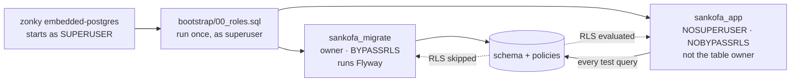

# Testing

> **What this is for:** the testing strategy for the Sankofa School Platform — what each layer of
> test is responsible for, how to write the seven mandatory test categories, and what we do when a
> test goes flaky. **Who reads it:** anyone writing or reviewing a test in this repository.

This document is normative where it restates `AGENTS.md`, and advisory where it explains *how*.
Where it conflicts with `AGENTS.md` or `docs/ARCHITECTURE.md`, those win.

---

## 0. What exists today

Honesty about state, so nobody reads this document as a description of a suite that is running.

| Thing | State |
|---|---|
| Maven Surefire configured for `**/*Test.java` (unit) | **Built** — `services/core-api/pom.xml` |
| Maven Failsafe configured for `**/*IT.java`, bound to `verify` | **Built** — same file |
| `io.zonky.test:embedded-postgres` on the test classpath, linux + windows binaries | **Built** |
| ArchUnit 1.5.0 (`archunit-junit5`) on the test classpath | **Built** |
| JaCoCo `check` on `verify`, `BUNDLE`/`LINE` limit | **Built**, floor currently `0.00` |
| `database/bootstrap/00_roles.sql` (referenced by `V0001`) | **Status: planned** — directory does not exist yet |
| Any Java test class | **Status: planned** — `src/test/java/io/sankofa/school` is empty |
| Vitest, Testing Library, Playwright, Firebase emulator suites | **Status: planned** — `apps/web`, `tests/e2e` are empty |
| CI workflows | **Status: planned** — `.github/workflows` is empty |

Everything below that is not marked *Built* is the design we are committing to, written down before
it exists so the first implementation does not have to invent it under deadline.

---

## 1. The pyramid, as it applies here

The classic shape holds, but the *reasons* are specific to a multi-tenant school ERP.

| Layer | Runs | Owns | Does **not** own |
|---|---|---|---|
| **Unit** (JUnit 5, Vitest) | milliseconds, no I/O | Arithmetic and rules: grading, proration, PAYE bands, state machines, date windows | Anything involving SQL, RLS, HTTP or the DOM |
| **Integration** (Failsafe + embedded PostgreSQL) | seconds | Everything the database enforces: RLS, triggers, constraints, `identity.effective_permissions`, transaction boundaries | UI behaviour |
| **Architecture** (ArchUnit) | milliseconds | Module seams from `ARCHITECTURE.md` §3 | Runtime behaviour |
| **Component** (Vitest + Testing Library) | milliseconds | Rendering, keyboard interaction, accessible names, error and empty states | Real network, real auth |
| **E2E** (Playwright) | minutes | The named critical journeys in §5, end to end, on real infrastructure | Exhaustive branch coverage |
| **Rules** (Firebase emulator) | seconds | Firestore and Storage security rules, allow **and** deny | Business logic |

The rule that decides which layer a test belongs in: **put the test at the lowest layer that can
still fail for the real reason.** A tenant-isolation bug cannot fail a unit test, because a unit
test has no RLS. A rounding bug does not need Playwright. Tests written at the wrong layer are slow
and vague, which is how suites become the thing people skip.

The pyramid is deliberately fat in the middle. Most of what can go catastrophically wrong here —
cross-tenant leakage, an unbalanced journal, a mutated posted entry — is enforced *in the database*,
and only an integration test against a real PostgreSQL with RLS on can observe it.

---

## 2. Java

### 2.1 Unit tests — `*Test.java`, run by Surefire

Domain logic, no Spring context. If a test needs `@SpringBootTest`, it is not a unit test.

- Pure `DomainService` classes take their inputs as arguments and return values. No framework
  types in a signature, so the test needs no container.
- `BigDecimal` everywhere money appears. `assertThat(x).isEqualByComparingTo("…")` when only the
  numeric value matters, `isEqualTo` when the **scale** is part of the contract (see §6.3).
- One behaviour per test. The method name is a sentence: `exemptComponentReweightsRemainder()`.
- A test whose only assertion is that no exception was thrown does not count (`AGENTS.md` §7).

### 2.2 Integration tests — `*IT.java`, run by Failsafe against embedded PostgreSQL

These run the real schema: real migrations, real policies, real triggers.



**Tests connect as `sankofa_app`, never as the superuser.** This is the single most important
sentence in this document.

PostgreSQL skips row-level security entirely for a superuser and for any role holding `BYPASSRLS`.
`FORCE ROW LEVEL SECURITY` does not change that — `FORCE` only removes the *table owner's*
exemption. So an isolation test executed on a superuser connection returns exactly the same rows
whether the policies are correct, wrong, or absent. It would pass against a database with every
`CREATE POLICY` deleted. It asserts nothing, while looking like the most important test in the
suite.

Zonky hands you a superuser connection by default, which is why this needs saying out loud.

Two guards keep the harness honest, and they are the first integration tests to write:

```java
class RlsHarnessGuardIT extends AbstractIntegrationTest {

    @Test
    void testConnectionIsNotPrivileged() throws SQLException {
        try (var c = appDataSource().getConnection();
             var rs = c.createStatement().executeQuery("""
                 select current_user,
                        current_setting('is_superuser') = 'on' as superuser,
                        (select rolbypassrls from pg_roles where rolname = current_user) as bypassrls
                 """)) {
            assertThat(rs.next()).isTrue();
            assertThat(rs.getString("current_user")).isEqualTo("sankofa_app");
            assertThat(rs.getBoolean("superuser")).isFalse();
            assertThat(rs.getBoolean("bypassrls")).isFalse();
        }
    }

    @Test
    void unscopedQueryFailsLoudly() {
        // platform.current_tenant_id() raises 42501 when app.tenant_id is unset (V0001).
        assertThatThrownBy(() -> jdbc.queryForList("select * from identity.membership"))
            .hasMessageContaining("app.tenant_id is not set");
    }
}
```

Without the first test, a future change that repoints the test `DataSource` at `postgres` to fix
some unrelated connection problem turns the whole isolation suite green and silent. That is a
plausible, well-intentioned mistake, and it is exactly the kind CI should catch.

Harness rules:

- **One embedded cluster per JVM.** Starting PostgreSQL costs seconds; starting it per class costs
  the suite. Start once in a JUnit 5 extension with `CloseableResource` on the root store.
- **Flyway runs once**, as `sankofa_migrate`, with `appRole` / `migrateRole` placeholders supplied.
  Run it a second time against the seeded database too (`AGENTS.md` §8): a migration that only ever
  meets an empty schema is untested for the case that matters in production.
- **Clean between tests by truncation, not by rollback.** `@Transactional` test rollback is
  convenient and wrong here: a deferred constraint trigger (Invariant I-4) fires at `COMMIT`, so a
  test that never commits can never observe it failing. Truncate the tenant tables in a
  `@BeforeEach`, and let each test manage its own transaction.
- **Reset the session variables between tests.** A leftover `app.tenant_id` makes the next test
  pass for the wrong reason. `DISCARD ALL` on connection return, or a fresh connection per test.
- `SET LOCAL app.tenant_id` requires a transaction. Setting it outside one is a silent no-op —
  another way to write a vacuous test.

### 2.3 ArchUnit — `ModuleBoundaryTest`

`ARCHITECTURE.md` §3 defines the seams; ArchUnit is what makes them real. Rules to encode:

| Rule | Why |
|---|---|
| No domain package may reference another domain package's `repository`, `entity` or `internal` | Cross-module reads go through the owner's `*Facade` |
| `platform` and `tenancy` may not depend on any domain package | They are shared kernels, and kernels do not know their callers |
| No class annotated `@Transactional` in `..controller..` or `..repository..` | Transaction boundary is the application service (`AGENTS.md` §5) |
| No field injection: no `@Autowired` on a field | Constructor injection only |
| No `double`/`float`/`Double`/`Float` in a field or method signature under `..finance..`, `..accounting..`, `..payroll..`, `..tax..` | Invariant I-2, mechanically |
| No entity type appears in a `@RestController` method signature | Entities never cross the HTTP boundary |

Freeze nothing. `FreezingArchRule` turns a violated rule into a recorded backlog, and the point of
these rules is that they are not negotiable. If a rule fails, the design is wrong, not the test
(`AGENTS.md` §4).

---

## 3. TypeScript

**Status: planned** in full — `apps/web` and `packages/*` are empty today.

### 3.1 Vitest unit

Pure functions in `lib/` and `packages/shared`: money formatting, date/timezone rendering, grade
band lookup, permission predicates used for *hiding* UI. Money is a `string` end to end; a test that
calls `parseFloat` on an amount is itself a defect (`AGENTS.md` §5).

### 3.2 Component tests — Vitest + Testing Library

Conventions, in priority order:

1. **Query by role and accessible name.** `getByRole('button', { name: 'Issue invoice' })`. If that
   query cannot find the element, a screen-reader user cannot find it either — the test failure is
   the accessibility bug, reported early and cheaply.
2. `getByLabelText` for form fields. Never `getByTestId` for anything a user perceives; `data-testid`
   is a last resort for a container with no semantic identity.
3. **Assert user-visible outcomes**, not state. "The balance now reads GHS 850.00", not "setState
   was called".
4. `userEvent`, not `fireEvent`. `userEvent.tab()` is how keyboard order gets tested.
5. Every component test for a data-bearing component asserts three states: **loading, empty, error**
   (Definition of Done items 7–9). The empty state assertion includes its text, because an empty
   state that says nothing useful fails §167.
6. Mock at the network boundary (MSW), not by stubbing the component's own imports. Responses are
   parsed through the same Zod schema production uses, so a contract drift fails the test.
7. `expect(await axe(container)).toHaveNoViolations()` on every component test — see
   `docs/ACCESSIBILITY.md`.

---

## 4. Critical journeys — Playwright

**Status: planned** — `tests/e2e` is empty; `npm run test:e2e` is declared in `AGENTS.md` §3.

> The authoritative list of critical journeys is §112 of the product specification, which is **not
> in this repository**. The specs below are the journeys this platform cannot ship broken; when the
> specification is added, reconcile this table against it and correct any divergence here.

Each row is one spec file under `tests/e2e/specs/`.

| Spec | Journey | What it proves |
|---|---|---|
| `auth-sign-in-mfa.spec.ts` | Sign in, satisfy MFA, land on the right workspace | Session cookie issued, MFA enforced where `mfa_required` |
| `auth-membership-switch.spec.ts` | User with memberships at two schools switches | Switching re-binds the membership; data changes with it |
| `tenant-isolation-negative.spec.ts` | Signed in at School A, request a School B URL and export | 403/404, no rows, no filename leak. The one spec that must never be quarantined |
| `admissions-application-to-enrolment.spec.ts` | Public application → review → offer → accept → enrolled student | The whole admissions funnel, including the public unauthenticated entry point |
| `student-enrolment-and-class-assignment.spec.ts` | Enrol a student, assign to class and stream | Student number allocation, no duplicates under the concurrency-safe sequence |
| `attendance-daily-register.spec.ts` | Teacher marks a register on a phone viewport, corrects one mark | The highest-frequency screen in the product, at 375px |
| `assessment-entry-to-published-report-card.spec.ts` | Enter marks → compute → publish → amend with a reason | Invariant I-5: post-publication change requires an amendment record |
| `fees-invoice-to-receipt.spec.ts` | Fee structure → invoice → part payment → receipt → balance | Money on screen matches money in the ledger |
| `payments-callback-reconciliation.spec.ts` | Payment provider callback, including a replayed one | Signature verified, idempotent, no double credit |
| `payroll-run-to-payslip.spec.ts` | Pay period → run → approve → payslips → journal posted | The most expensive thing to get wrong |
| `guardian-portal-view-and-pay.spec.ts` | Guardian sees only their own children, pays an invoice | Guardian scoping, mobile-first |
| `timetable-build-and-clash-detection.spec.ts` | Build a timetable, provoke a teacher clash, substitute | Clash detection is refused server-side, not just warned client-side |

Rules for E2E:

- **No test-only back doors in production code.** Seed through the real API as a real user with real
  permissions, or through a seed script that refuses to run outside dev (`AGENTS.md` §3).
- Each spec creates its own tenant with a unique slug and tears it down. Shared fixture tenants
  produce order-dependent suites.
- Assert on accessible names, the same as component tests — one query vocabulary across both layers.
- Run against a production **build**, never the dev server.
- Trace and video on first retry, retained on failure. A flaky E2E with no trace is unactionable.

---

## 5. Firebase rules — emulator tests

**Status: planned** — `infrastructure/firebase` is empty.

Rules are a security boundary (`AGENTS.md` prohibition 4), so they get tests, and the **deny** cases
are the point. Use `@firebase/rules-unit-testing` against the emulator, with `assertFails` /
`assertSucceeds`.

Firestore (E2EE envelopes, presence, notification feed):

- Deny: a user in tenant A reading an envelope document under tenant B.
- Deny: reading another user's device public-key registration for a tenant they do not belong to.
- Deny: writing an envelope whose `senderId` is not the authenticated uid — forging a sender.
- Deny: any client write to a notification feed document (server writes only).
- Allow: a participant reading an envelope addressed to their own device.

Storage:

- Deny: reading a path under another tenant's prefix, with a valid token for tenant A.
- Deny: upload exceeding the size ceiling, and upload of a disallowed content type.
- Deny: any read without a token, proving the bucket is private.
- Allow: the owning tenant reading its own document path.

If a feature needs a rule relaxed, the rule change comes with its new deny test in the same commit.

---

## 6. The mandatory categories, worked

`AGENTS.md` §7 lists seven categories. Each is worked here once, concretely, so the first
implementation copies a real shape rather than inventing one.

### 6.1 Cross-tenant isolation

Required whenever a change touches a tenant-owned table. Three assertions, not one: **read**,
**write**, and **unscoped**.

```java
class ClassGroupTenantIsolationIT extends AbstractIntegrationTest {

    private UUID schoolA, schoolB, groupInB;

    @BeforeEach
    void seed() {
        schoolA = tenants.create("greenfield");
        schoolB = tenants.create("kwabena-memorial");
        groupInB = asTenant(schoolB, () -> classGroups.create("JHS 2 Blue"));
    }

    @Test
    void tenantACannotReadTenantBsRow() {
        asTenant(schoolA, () -> {
            assertThat(jdbc.queryForList(
                "select id from academics.class_group where id = ?", groupInB))
                .isEmpty();                       // RLS filters, it does not error
            assertThat(classGroupRepository.findById(groupInB)).isEmpty();
        });
    }

    @Test
    void tenantACannotWriteIntoTenantB() {
        asTenant(schoolA, () ->
            assertThatThrownBy(() -> jdbc.update(
                "insert into academics.class_group (id, tenant_id, name) values (?, ?, ?)",
                Ids.newId(), schoolB, "smuggled"))
                .hasMessageContaining("row-level security"));   // WITH CHECK refuses it
    }

    @Test
    void updateCannotMoveARowToAnotherTenant() {
        UUID groupInA = asTenant(schoolA, () -> classGroups.create("JHS 2 Gold"));
        asTenant(schoolA, () ->
            assertThatThrownBy(() -> jdbc.update(
                "update academics.class_group set tenant_id = ? where id = ?", schoolB, groupInA))
                .hasMessageContaining("row-level security"));
    }
}
```

Notes that matter: a cross-tenant **read** returns *empty*, a cross-tenant **write** *raises* —
they are different policy clauses (`USING` vs `WITH CHECK`) and both need proving. The third test
covers the case people forget: moving an existing row across the boundary. And the API-level
equivalent returns **404, not 403**, for a resource in another tenant — a 403 confirms the record
exists, which is itself a leak.

### 6.2 Permission matrix

Required whenever a permission is added or changed. Assert the allow **and** the deny.

```java
class InvoicePermissionMatrixIT extends AbstractIntegrationTest {

    static Stream<Arguments> matrix() {
        return Stream.of(
            //        role,        permission,              expected
            arguments("BURSAR",   "FINANCE_INVOICE_ISSUE",  ALLOW),
            arguments("BURSAR",   "PAYROLL_RUN_APPROVE",    DENY),
            arguments("HEAD",     "FINANCE_INVOICE_ISSUE",  DENY),   // approves, does not issue
            arguments("HEAD",     "FINANCE_INVOICE_READ",   ALLOW),
            arguments("TEACHER",  "FINANCE_INVOICE_READ",   DENY),
            arguments("GUARDIAN", "FINANCE_INVOICE_READ",   ALLOW),  // own children only — §6.1
            arguments("TEACHER",  "HEALTH_RECORD_READ",     DENY));  // child-sensitive
    }

    @ParameterizedTest(name = "{0} {2} {1}")
    @MethodSource("matrix")
    void roleHoldsExactlyTheExpectedPermission(String role, String permission, Effect expected) {
        UUID membership = memberships.withRole(tenantA, role);
        assertThat(identity.effectivePermissions(membership).contains(permission))
            .isEqualTo(expected == ALLOW);
    }

    @Test
    void directDenyBeatsRoleAllow() {
        UUID membership = memberships.withRole(tenantA, "BURSAR");
        grants.deny(membership, "FINANCE_INVOICE_ISSUE", "under investigation");
        assertThat(identity.effectivePermissions(membership)).doesNotContain("FINANCE_INVOICE_ISSUE");
    }

    @Test
    void expiredGrantIsIgnored() { … }   // expires_at in the past → not effective
}
```

The matrix tests `identity.effective_permissions` — the single authoritative definition in `V0002`.
A second, parallel test covers the HTTP surface: the same role hitting the endpoint gets `200` or
`403` with the canonical error shape and no payload. Both layers, because a permission that resolves
correctly but is never checked by the controller is not enforced.

### 6.3 Money, with exact `BigDecimal` assertions

Required whenever a change touches money. Exact values, including rounding and a partial payment.

```java
class InvoiceBalanceTest {

    @Test
    void partialPaymentLeavesExactBalance() {
        Money fee     = Money.of("1250.0000", "GHS");
        Money paid    = Money.of("400.0000",  "GHS");
        Money balance = fee.minus(paid);

        assertThat(balance.amount()).isEqualTo(new BigDecimal("850.0000")); // value AND scale
        assertThat(balance.currency()).isEqualTo("GHS");
    }

    @Test
    void threeInstalmentsSumBackToTheTotalExactly() {
        List<Money> parts = Money.of("1250.0000", "GHS").splitEvenly(3);

        assertThat(parts).containsExactly(
            Money.of("416.6667", "GHS"),
            Money.of("416.6667", "GHS"),
            Money.of("416.6666", "GHS"));   // last absorbs the remainder
        assertThat(Money.sum(parts)).isEqualTo(Money.of("1250.0000", "GHS"));
    }

    @Test
    void currenciesNeverMixSilently() {
        assertThatThrownBy(() -> Money.of("10.0000", "GHS").plus(Money.of("10.0000", "USD")))
            .isInstanceOf(CurrencyMismatchException.class);
    }
}
```

Three things this pins down. `isEqualTo` on `BigDecimal` compares **scale** as well as value, so
`850.00` fails against `850.0000` — use it where the scale is contractual and
`isEqualByComparingTo` only where it genuinely is not. Second, `splitEvenly` must allocate the
remainder rather than round each part independently, or three instalments of `416.6667` overcharge
by `0.0001` — small, until it is a term's worth of invoices reconciled against a bank statement.
Third, every arithmetic operation carries its currency (Invariant I-2).

### 6.4 Balanced journal

Required whenever a change touches a journal.

```java
class JournalBalanceIT extends AbstractIntegrationTest {

    @Test
    void balancedJournalCommits() {
        asTenant(schoolA, () -> {
            UUID j = journals.draft("Invoice INV-2026-000045");
            journals.line(j, DEBIT,  "1200-ACCOUNTS-RECEIVABLE", "1250.0000", "GHS");
            journals.line(j, CREDIT, "4000-TUITION-INCOME",      "1250.0000", "GHS");
            journals.post(j);                                    // commits
            assertThat(ledger.balanceOf("1200-ACCOUNTS-RECEIVABLE"))
                .isEqualTo(Money.of("1250.0000", "GHS"));
        });
    }

    @Test
    void unbalancedJournalIsRejectedAtCommit() {
        assertThatThrownBy(() -> asTenant(schoolA, () -> {
            UUID j = journals.draft("wrong");
            journals.line(j, DEBIT,  "1200-ACCOUNTS-RECEIVABLE", "1250.0000", "GHS");
            journals.line(j, CREDIT, "4000-TUITION-INCOME",      "1200.0000", "GHS");
            journals.post(j);
        })).hasMessageContaining("does not balance");
    }

    @Test
    void postedJournalRejectsMutation() {
        UUID j = asTenant(schoolA, () -> journals.postBalanced("1250.0000"));
        asTenant(schoolA, () -> {
            assertThatThrownBy(() -> jdbc.update(
                "update accounting.journal_line set amount = ? where journal_id = ?",
                new BigDecimal("1.0000"), j)).hasMessageContaining("append-only");
            assertThatThrownBy(() -> jdbc.update(
                "delete from accounting.journal_line where journal_id = ?", j))
                .hasMessageContaining("append-only");
        });
    }
}
```

The unbalanced case **must commit to fail**. Invariant I-4 is a deferred constraint trigger
evaluated at commit, so a test wrapped in a rolled-back transaction passes while asserting nothing.
This is the concrete reason §2.2 forbids `@Transactional` rollback in the integration harness. The
third test is Invariant I-3 and goes straight at SQL, deliberately bypassing the service layer —
the trigger, not the service, is the control being tested (`AGENTS.md` prohibition 6).

### 6.5 Grading determinism

Required whenever grading changes. One fixture, four behaviours: weighting, ties, absent, exempt.

Fixture — components `CA1` weight 15, `CA2` weight 15, `Exam` weight 70, each marked out of 100.

| Student | CA1 | CA2 | Exam | Expected score | Expected rank |
|---|---|---|---|---|---|
| Ama | 68 | 74 | 81 | `78.00` | 2 |
| Kofi | 90 | 88 | 76 | `81.00` | 1 |
| Yaa | 72 | 70 | 81 | `78.00` | 2 |
| Kwame | 68 | *absent* | 81 | `66.90` | 4 |
| Efua | 68 | *exempt* | 81 | `78.71` | 3 |

```java
@Test void weightedAverageIsExact()      { assertThat(score("Ama")).isEqualTo(bd("78.00")); }
@Test void absentScoresZeroAndKeepsWeight() { assertThat(score("Kwame")).isEqualTo(bd("66.90")); }
@Test void exemptRemovesWeightAndReweightsRemainder() {
    // (68*15 + 81*70) / 85 = 6690/85 = 78.70588…  → HALF_UP at scale 2
    assertThat(score("Efua")).isEqualTo(bd("78.71"));
}
@Test void tiesShareRankAndSkipTheNext() {           // competition ranking: 1, 2, 2, 4
    assertThat(ranks()).containsExactly(
        entry("Kofi", 1), entry("Ama", 2), entry("Yaa", 2), entry("Efua", 3), entry("Kwame", 4));
}
@Test void recomputationIsStable() {                  // same input, 100 runs, same output
    assertThat(IntStream.range(0, 100).mapToObj(i -> compute(fixture)).distinct()).hasSize(1);
}
```

The distinction the fixture exists to pin: **absent scores zero and keeps its weight** (the student
was assessed and did not attend), **exempt removes its weight and renormalises the remainder** (the
student was never assessed on it). Getting these the same way round is the whole point, and no
amount of prose in a service class protects it the way this table does.

Two decisions this fixture encodes, both of which need an ADR before they ship (`AGENTS.md` §10):
rounding is `HALF_UP` at scale 2 for a published score, and **rank is computed on the rounded,
published score** so that what a parent sees explains the position they were given.

`recomputationIsStable` is not busywork. Grading that iterates a `HashMap` can produce different
tie ordering per JVM run; publishing two different rank sheets for the same marks is a support
call nobody can answer.

### 6.6 State machine

Required for any state machine. Every legal transition, and — stronger than `AGENTS.md`'s minimum
of one — **every illegal one**, by enumerating the cartesian product.

```java
class InvoiceStateMachineTest {

    static final Set<Transition> LEGAL = Set.of(
        t(DRAFT, ISSUED),   t(DRAFT, VOID),
        t(ISSUED, PARTIALLY_PAID), t(ISSUED, PAID), t(ISSUED, VOID), t(ISSUED, WRITTEN_OFF),
        t(PARTIALLY_PAID, PAID), t(PARTIALLY_PAID, WRITTEN_OFF));

    @ParameterizedTest
    @MethodSource("allOrderedPairs")            // 6 x 6 = 36, including self-transitions
    void onlyDeclaredTransitionsAreAccepted(InvoiceState from, InvoiceState to) {
        if (LEGAL.contains(t(from, to))) {
            assertThat(machine.transition(from, to)).isEqualTo(to);
        } else {
            assertThatThrownBy(() -> machine.transition(from, to))
                .isInstanceOf(IllegalTransitionException.class)
                .hasMessageContaining(from.name())
                .hasMessageContaining(to.name());
        }
    }

    @Test
    void paidInvoiceCannotBeVoided() {          // named, because the reason is not obvious
        assertThatThrownBy(() -> machine.transition(PAID, VOID))
            .isInstanceOf(IllegalTransitionException.class);
        // Money moved. Correction is a credit note or a refund, never a state rewrite (I-3).
    }
}
```

Enumerating the product means adding a seventh state cannot quietly widen the machine: the new
state's 13 pairs all land in the illegal branch until someone deliberately adds them to `LEGAL`.

### 6.7 Firestore / Storage rule

Covered in §5. The deny test ships in the same commit as the rule.

---

## 7. Test data

**Fixtures, not generators, wherever a number is asserted.**

A random generator producing a fee of `GHS 1 838.4173` forces the test to compute its own expected
balance — and the only sane way to do that is the same arithmetic the production code uses. The
test then asserts that the code agrees with itself, which it always will, including when both are
wrong. A hand-computed golden number (`78.71`, `416.6666`, `850.0000`) is an *independent*
statement of the right answer. That independence is the entire value of the test.

So:

- **Object mothers / builders** with a sensible default and a fluent override:
  `aStudent().inClass("JHS 2 Blue").withOutstanding("850.0000").build()`. The default is realistic;
  the test overrides only the field it is about, so the test reads as its own intent.
- **Named scenario fixtures** for the multi-row cases — the grading table in §6.5 lives in one
  fixture, referenced by five tests. Change the weighting, five tests fail, which is correct.
- **Ghanaian-realistic data**: names, `GHS`, `+233` numbers, a three-term year, PAYE bands as
  effective-dated rows. Not because it is decorative, but because unrealistic data hides real bugs —
  a two-term assumption, a currency symbol hard-coded, a name parser that needs a middle name.
- **Deterministic time.** Inject a `Clock`; never call `Instant.now()` in domain code. A payroll
  test that behaves differently on the 31st is a test that will fail once a month forever.
- **Fixed seeds** where randomness is genuinely useful.

Property-based testing has one good use here and one bad one. Good: asserting an *invariant* over
generated input — "for any set of lines a posted journal accepts, debits equal credits", "for any
positive total and any n, `splitEvenly` sums back to the total exactly". Bad: deriving an *expected
value*. Invariants, yes. Oracles, no.

Personal data in fixtures is synthetic. Never a production export, not even redacted — a redacted
export is still a re-identification risk and still someone's child.

---

## 8. Flake policy

**A flaky test is a bug.** It is either a bug in the test, a bug in the harness, or — often — a real
race in the product that only manifests occasionally. All three are worth the hour.

The procedure, with no discretion in it:

1. A test that fails and then passes with no code change is flaky from that moment. It does not
   matter that the retry was green.
2. Open a ticket **before** touching the test. It names the test, links the failed run, and has an
   owner and a due date. No owner, no quarantine.
3. Quarantine is **time-boxed to five working days**, recorded in `tests/QUARANTINE.md` with the
   ticket link and the expiry date. CI fails the build when an entry is past expiry. A quarantine
   with no expiry is just deletion with extra steps.
4. A quarantined test keeps running, in a **non-blocking** job. The point is to keep collecting
   failure data while it is out of the critical path.
5. **Never `@Disabled`, never deleted** (`AGENTS.md` prohibition 2). Never `retry: 3` added to make
   a spec stable — retries are for genuine infrastructure noise and are configured once, globally,
   not sprinkled on the tests that annoy people.
6. Three tests in quarantine at once is a stop-the-line event: fix them before starting features.

Two tests may **never** be quarantined, at all, for any reason: the cross-tenant isolation suite and
`RlsHarnessGuardIT`. If either is red, the build is red and the release does not go. There is no
version of "we will look at it Monday" that is acceptable for a control that keeps one school's
children out of another school's records.

Common causes here, in the order they actually occur: leftover `app.tenant_id` between tests; a
shared fixture tenant making tests order-dependent; `Instant.now()` in domain code; Playwright
asserting before a server action settles; and a `HashMap` iteration order leaking into a ranking.

---

## 9. Coverage

**Coverage is a smoke detector, not a goal.** It tells you where nobody looked. It cannot tell you
whether what you wrote is correct, and a suite can reach 90% while asserting almost nothing — every
line executed inside a test whose only assertion is that no exception was thrown.

What we measure and where the floors sit:

| Scope | Metric | Floor | Note |
|---|---|---|---|
| `services/core-api` bundle | JaCoCo `LINE` | `0.00` today | **Built** — `jacoco.line.coverage` in `pom.xml`. Raised as modules land |
| Domain services (`..domain..`) | `LINE` + `BRANCH` | 85% target | **Status: planned** — needs a per-package JaCoCo rule |
| `finance`, `accounting`, `payroll`, `tax`, `grading` | `BRANCH` | 90% target | **Status: planned**. These decide money and futures |
| Controllers, DTOs, config | — | not chased | Covered by integration and E2E, or not worth covering |
| `apps/web` | Vitest V8 line | to be set | **Status: planned** |

Rules about the number:

- The floor **only ever goes up**. The POM comment already says so. Lowering a floor to make a build
  pass is the coverage equivalent of deleting a test, and gets the same answer in review.
- A pull request that drops overall coverage explains why in the description. Sometimes the answer
  is "deleted a lot of code", which is fine.
- **Never** write a test whose purpose is the percentage. It will be the test that asserts nothing,
  and it makes the detector quieter while the house gets no safer.
- The seven mandatory categories in §6 are *not* satisfied by coverage. A module can be at 95% and
  still be missing its isolation test, and that module is not done (`AGENTS.md` §2, item 11).

Mutation testing (PIT) on `finance`, `accounting` and `grading` would answer the question coverage
cannot — do the assertions actually detect a changed result. **Status: planned**, not configured,
worth doing once those modules exist.

---

## 10. Running it

```bash
./mvnw test                            # unit only, seconds
./mvnw verify                          # unit + integration + ArchUnit + coverage check
./mvnw test -Dtest=TenantIsolation*    # focused
npm run test                           # Vitest unit + component
npm run test:e2e                       # Playwright
```

CI (**Status: planned** — `.github/workflows` is empty) runs, in order, failing fast on the first:
`typecheck` → `lint` → `npm run test` → `./mvnw verify` → `flyway:validate` → rules emulator →
Playwright → axe scan. Migration checksum drift fails the build (`AGENTS.md` §8).

A red build is never merged around. Re-running a job until it goes green is a flake report, and §8
applies.
