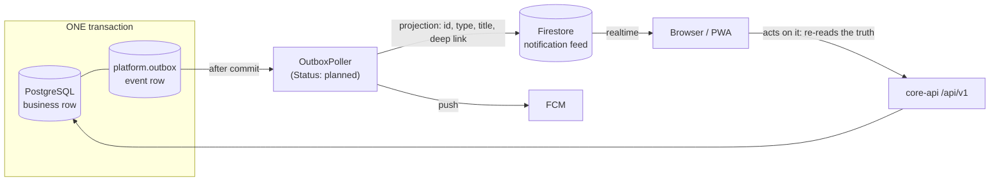

# 0001. PostgreSQL as the system of record

> **What this is for:** it fixes which datastore owns business truth and what Firestore is permitted
> to hold. Read it before adding any collection, cache or "we could just put it in Firestore" feature.

## Status

Accepted — 2026-09-18

## Context

This product is two systems wearing one coat.

The first is a school ERP: a double-entry ledger, invoices and receipts, a payroll run that produces
payslips a labour inspector may read three years later, and a grading pipeline where a published mark
is a document a family relies on. These want multi-row atomicity, referential integrity checked at
write time, exact decimal arithmetic, and set-based reporting over years of accumulated history.

The second is a realtime surface: end-to-end encrypted chat, presence, and a notification feed that
should light up a bell icon without the browser polling. These want fan-out to connected clients in
under a second, an offline queue on the device, and delivery that does not depend on our container
being warm.

Those are opposite shapes, and the pull toward collapsing them is real. Firebase is already in the
stack — Auth owns credentials (ADR [0004](0004-firebase-auth-with-db-authorization.md)), Storage owns
documents, FCM owns push. Adding Firestore as "the database" would delete a whole tier. It is the
cheap-looking answer and it is wrong for anything that touches money or a grade.

The disqualifying detail is arithmetic. A Firestore numeric field is an IEEE-754 double. Invariant
I-2 forbids `double` for money anywhere in this system, so fees in Firestore would have to be stored
as strings, added somewhere else, and written back. At that point the datastore contributes nothing
to correctness — it is a JSON blob with a sync client attached, and every constraint we would rely on
(a journal balances, an invoice line's amount matches its allocation, a payment cannot exceed a
balance) becomes an application convention that one forgotten code path breaks silently.

The rest follows from that. Firestore has no joins, so a trial balance becomes a client-side
assembly. It has no server-side aggregate over an arbitrary predicate, so "total outstanding fees for
Form 3" is a counter you maintain by hand and reconcile when it drifts. Its read-priced cost model
means a term-end financial report scans and bills for every document it touches. Its transaction
scope is a bounded set of documents, not "everything this posting touched". And its security model is
per-document rules evaluated against a token — which cannot express the per-transaction tenant
binding that Invariant I-1 rests on (ADR [0003](0003-tenant-isolation-strategy.md)).

What Firestore is genuinely good at, we actually need. It fans out a write to every subscribed client
without our service holding a connection — which matters because `core-api` runs on a container
runtime that scales to zero and has no business owning thousands of long-lived sockets. Its SDK
queues writes offline and replays them, which is the difference between a usable and a useless chat
app on a Ghanaian mobile network. And for E2EE chat specifically, we *want* a store that holds opaque
bytes and knows nothing: the server cannot leak plaintext it never had.

## Decision

**PostgreSQL 16+ is the transactional system of record for every business entity.** Students,
enrolments, marks, invoices, payments, journals, payslips, assets, loans, staff records — all of it,
with the conventions in `docs/ARCHITECTURE.md` §5 and the RLS contract established in
`V0001__platform_core.sql`.

**Firestore is confined to exactly three things:**

| Firestore holds | Authority | PostgreSQL counterpart |
|---|---|---|
| E2EE chat envelopes (ciphertext + routing header) | Authoritative for the ciphertext only | `messaging` holds device registry and envelope metadata |
| Presence / typing indicators | Authoritative, and disposable | none |
| Realtime notification feed documents | **Projection only** | `communications` notification rows |

Three rules make that boundary hold:

1. **No business entity lives in Firestore.** If losing the collection would lose a fact the school
   needs, it is in the wrong place.
2. **Money never touches Firestore.** No amount, no currency, no balance, no fee total — not even for
   display. A notification says "Invoice INV-2026-000045 is ready", never "GHS 1,250.00".
3. **The seam is one-directional.** PostgreSQL commits, the outbox row commits with it
   (`platform.outbox`, V0001), and a dispatcher writes the Firestore document afterwards. Firestore
   never writes back into PostgreSQL except as an ordinary authenticated client of `/api/v1`, subject
   to the same authorization as a browser.

The projection carries an identifier, a type, a title, a timestamp and a deep link — never a value
the user acts on. When the browser opens the item it re-reads the API, which re-reads PostgreSQL,
which re-applies RLS and permissions. A client that trusts a feed document has a bug.

E2EE chat is the single deliberate exception to "Firestore holds only projections": the ciphertext
has no PostgreSQL counterpart, because we hold no plaintext to store (ADR
[0007](0007-e2ee-messaging-protocol.md)). PostgreSQL still owns who may be in a conversation.

## Consequences

### Positive

- One place to answer "what is true". At 2am, a discrepancy is a SQL query, not a reconciliation
  between two stores with different clocks.
- Correctness is enforced where the write lands: check constraints, foreign keys, deferred constraint
  triggers for balanced journals (I-4), and immutability triggers for posted rows (I-3). Those hold
  against a bug in the service layer, a psql session and a future rewrite alike.
- Tenant isolation has a single mechanism on the data that matters, rather than one model for
  PostgreSQL and a re-implementation of it in Firestore rules.
- Financial and academic reporting is set-based and cheap. A trial balance is one query over an
  index, not a fan-out that bills per document.
- Point-in-time recovery restores a consistent record. Firestore's contents are reconstructible: the
  notification feed regenerates from the outbox, presence is ephemeral, chat envelopes have their own
  retention and are independently exportable.

### Negative

- Two datastores, two consistency models, two security models. Every engineer here has to be fluent
  in RLS policies *and* Firestore rules, and a reviewer has to check both on any change that crosses
  the seam.
- Two test harnesses: real PostgreSQL via zonky embedded (ADR
  [0012](0012-testing-database-strategy.md)) plus the Firebase emulator for rules. AGENTS.md §7
  requires an emulator test proving the deny case on every rule change, and that is slower than a
  unit test.
- The sync seam has latency and can fail. A notification exists in PostgreSQL before it exists in
  Firestore, so "the bell did not ring" and "the thing did not happen" are different incidents that
  look identical to a user on the phone.
- Local development needs both running.

### Risks accepted

- **The feed can lag or drop a document.** Accepted, because it is a convenience surface: the badge
  reconciles against the API on focus, and Invariant I-8 means a failed dispatch is recorded and
  surfaced rather than swallowed. It is never the only route to a fact.
- **A Firestore rules defect could expose envelope metadata.** Mitigated by holding ciphertext only
  and by minimising the routing header; not eliminated. A rules regression is treated as a security
  incident, not a bug.
- **Firestore read cost scales with presence and feed chatter**, not with revenue. We accept it at
  current scale and will revisit if it becomes a material line item.
- **Drift is the long-term risk**: someone adds a convenient field to a feed document, then a second
  reader starts trusting it, and eventually a number lives in two places. The structural defence is
  that money is banned outright — an amount in a Firestore path is a mechanical, greppable violation
  rather than a judgement call. **Status: planned** — a CI check that fails the build on a monetary
  field name or a non-allowlisted collection path in `firestore.rules` and the dispatcher's
  projection code. Until it lands, this is enforced by review only, which is weaker and known to be.

## Alternatives considered

**Firestore as the system of record, PostgreSQL dropped.** Loses on money before anything else:
IEEE-754 doubles, no exact decimal, no cross-document invariant. Beyond that, a posted journal's
immutability would be a client convention rather than a trigger, correction-by-reversal could not be
enforced, and an auditor's first question — "show me every entry touching this account in this
period" — becomes a paid full scan assembled in application code. It would also force our tenancy
model into per-document rules that cannot express a per-transaction tenant binding.

**PostgreSQL only; realtime built in `core-api` over SSE or WebSockets.** Genuinely tempting: one
store, one security model, one test harness. It lost on operational shape — we would own fan-out,
reconnection, an offline queue, presence expiry and mobile background delivery, on a runtime that
scales to zero and terminates idle connections. That is a distributed-systems project competing with
the actual product. Worth reconsidering if Firestore cost or the two-model tax outgrows it; the seam
is deliberately narrow enough that swapping the transport would not touch a domain module.

**PostgreSQL plus Redis pub/sub plus our own socket tier.** Same build as above with an extra
stateful component to run, secure, back up and page someone about. Rejected on operational cost, not
on technical merit.

**PostgreSQL `LISTEN`/`NOTIFY` pushed to browsers.** No durability (a disconnected client misses the
event entirely), an 8000-byte payload ceiling, a database connection held per listener, and nothing
for mobile background delivery. Fine for intra-process cache invalidation; not a user-facing feed.

**Supabase Realtime, or logical replication, streaming the same PostgreSQL tables to clients.**
Attractive because it removes the second store. It lost on isolation: our RLS is keyed on
`app.tenant_id` set per transaction via `SET LOCAL` from a verified membership, and a replication
stream has no transaction to carry that setting. Isolation would have to be re-derived from the token
in a second, independently-written rule set over the same rows — which is precisely the duplicated
security model this ADR is trying to avoid, and on the highest-value tables rather than the lowest.

**A document store alongside PostgreSQL for "flexible" school-specific fields.** Out of scope here
and rejected separately: per-tenant custom fields are modelled as effective-dated configuration data
in PostgreSQL (I-6), not as schemaless documents.
