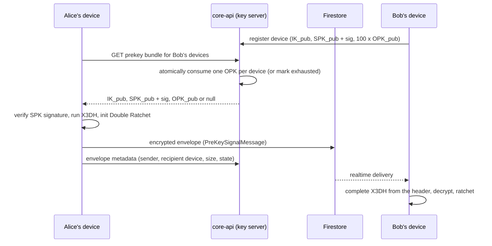

# 0007. End-to-end encrypted messaging protocol

*What this is for: deciding how in-app messages between staff, guardians and students are encrypted, and what the server can and cannot see. Read it if you are implementing the `messaging` module, reviewing its security, or answering a school's question about who can read a message.*

## Status

Accepted — 2026-09-18

**Implementation status: planned.** No `messaging` module, device registry table or client
crypto code exists in this repository yet. This ADR fixes the protocol choice and the honesty
rules before anyone writes the first line, because those are the decisions that are expensive
to reverse.

## Context

Schools run real conversations through these systems: a teacher raising a concern about a
child with a parent, a bursar discussing arrears, a head teacher handling a complaint. In
Ghana and everywhere else, the operator of a school platform is an obvious target for anyone
who wants that content — an attacker with a database dump, a subpoena, a curious employee,
or a misconfigured backup bucket.

`ARCHITECTURE.md` already places encrypted envelopes in Firestore and states that the server
never holds plaintext. This ADR makes that concrete.

Three things are genuinely hard here, and all three have been got wrong by serious teams:

1. **Asynchronous key agreement.** The recipient is usually offline. A protocol that needs
   both parties online is useless for a parent who checks the app at 9pm.
2. **Forward secrecy and post-compromise recovery.** Compromising a device today should not
   hand over last term's messages, and should not grant permanent future access.
3. **Multi-device.** A teacher has a phone and a school laptop. A parent has a phone and
   sometimes a shared family tablet.

We are not qualified to invent a protocol that solves those, and neither is almost anyone.
The failure mode of home-grown cryptography is silent: it looks identical to the working
version until someone competent looks at it.

There is also a tension this ADR must address rather than dodge. A school may have a
safeguarding duty to review communication between staff and children. True end-to-end
encryption prevents that by construction. Any design that quietly preserves the school's
ability to read those messages is not end-to-end encrypted, and calling it that is a lie to
the people whose messages they are.

## Decision

**Use a mature, audited implementation of the Signal protocol — `libsignal` — for message
encryption. Write no cryptographic primitives and no protocol logic of our own.**

We consume `libsignal` at the client (browser/PWA via its WebAssembly build, and in any
future native app via its platform bindings). The server's role is limited to storing and
relaying opaque ciphertext and the key material that is designed to be public.

### X3DH — how two parties agree a key without being online together

X3DH (Extended Triple Diffie-Hellman) lets Alice start an encrypted conversation with Bob
while Bob is asleep. Bob publishes a **prekey bundle** to the server ahead of time; Alice
fetches it and derives a shared secret unilaterally.

| Key | Lifetime | Published to server | Purpose |
|---|---|---|---|
| Identity key (IK) | Life of the device | Public part | Long-term identity of one device |
| Signed prekey (SPK) | Rotated on a schedule | Public part + signature by IK | Proves the bundle came from this identity |
| One-time prekeys (OPK) | Consumed once | Public parts, in batches | Forward secrecy for the very first message |
| Ephemeral key (EK) | One handshake | Sent in the initial message | Alice's contribution to the handshake |

Alice computes four Diffie-Hellman outputs and concatenates them into the root secret:

```
DH1 = DH(IK_A, SPK_B)      binds Alice's identity to Bob's signed prekey
DH2 = DH(EK_A, IK_B)       binds Bob's identity to Alice's ephemeral key
DH3 = DH(EK_A, SPK_B)      the main ephemeral exchange
DH4 = DH(EK_A, OPK_B)      present only when a one-time prekey was available
SK  = KDF(DH1 || DH2 || DH3 || DH4)
```

`libsignal` does this. We do not implement it. What we own is the plumbing: publishing
bundles, serving them, consuming one-time prekeys atomically, and replenishing them.



### Double Ratchet — what happens after the handshake

X3DH produces one shared secret. The Double Ratchet turns it into a fresh key for every
single message. Two ratchets run in combination:

- **Diffie-Hellman ratchet.** Each party attaches a new DH public key to its messages. When
  you receive a new one from the other side, you perform a DH and derive a new root key. This
  is what gives **post-compromise security**: an attacker who stole your keys loses access
  once one uncompromised DH ratchet step happens.
- **Symmetric-key ratchet.** Within a sending chain, each message key is derived from the
  previous chain key with a one-way KDF, and the message key is deleted after use. This is
  what gives **forward secrecy**: yesterday's ciphertext cannot be decrypted with today's
  state.

Out-of-order and delayed messages are handled by skipped-message keys, cached with a bounded
limit (`libsignal` enforces one; do not raise it to "fix" a sync bug — investigate the bug).

### Device registry

Every device gets its own identity key. A user is a set of devices, and each device is a
separate cryptographic party.

Planned schema, `messaging` schema, tenant-owned, RLS-enforced like everything else:

| Table | Holds | Notably does not hold |
|---|---|---|
| `messaging.device` | device id, user id, public identity key, label, registered_at, last_seen_at, revoked_at | any private key |
| `messaging.signed_prekey` | device id, key id, public key, signature, created_at, replaced_at | private key |
| `messaging.one_time_prekey` | device id, key id, public key, consumed_at | private key |
| `messaging.envelope_meta` | sender device, recipient device, conversation id, sent_at, byte size, delivery state | ciphertext, plaintext, keys |

Private keys exist only in device-local secure storage (IndexedDB behind the browser origin,
Keychain/Keystore on native). They are never transmitted, never backed up to us, never logged.

**The rule that decides whether this is honest: if the server can obtain a decryption key —
through escrow, key backup, a "recovery" feature, or a debug endpoint — then the system is
not end-to-end encrypted and we must stop using that term in the product, the marketing site
and the contract.** There is no version of this where we hold keys and keep the label.

### Prekey exhaustion

One-time prekeys are consumed one per new session. They run out. Handle it explicitly:

- Client uploads a batch of 100 on registration.
- Server exposes remaining count to the owning device; client replenishes when it drops
  below 20, on app start and on a background refresh.
- Consumption is atomic — `DELETE ... RETURNING` or an equivalent single statement. Two
  senders must never receive the same one-time prekey.
- **When the batch is empty, the server serves a bundle with no OPK.** X3DH proceeds using
  DH1–DH3 only. This is the designed degradation: the session still works, but that first
  message loses one layer of forward secrecy. It is not an error, and it must not be an
  outage. Record a metric and surface a warning to the device, not to the sender.

### Multi-device: per-device sessions, not sender keys

Two standard options:

- **Per-device pairwise sessions.** The sender encrypts separately for every recipient
  device. Cost is O(devices) ciphertexts per message.
- **Sender keys.** The sender distributes one chain key to the group and encrypts once. Cost
  is O(1) per message but the key distribution and revocation logic is substantially more
  complex, and removing a member requires rotating the sender key.

**We choose per-device pairwise sessions.** A school conversation is a teacher and a parent,
or a small defined group — typically under ten devices, not a thousand. The fan-out cost is
irrelevant at that size, and the simpler model has fewer ways to get revocation wrong.
Sender keys are revisited only if we later support large E2EE groups, which we currently do
not intend to: **school-wide announcements are not E2EE**. They go through the notification
service in ADR-0006, where the school legitimately owns the content and needs delivery
reporting.

### Key rotation

| Key | Rotation | Trigger |
|---|---|---|
| Signed prekey | Every 7 days, old one retained 30 days for in-flight messages | Scheduled, client-driven |
| One-time prekeys | Replenished below 20 remaining | On use |
| Session keys | Every message (symmetric ratchet), every round trip (DH ratchet) | Automatic |
| Identity key | Never rotated in place — a new identity key means a new device registration | Reinstall, new device, revocation |

### Lost device: history is not recoverable

Say this plainly, in the product, before the user has anything to lose:

> If you lose your device or clear the app's data, messages already on that device are gone.
> We cannot recover them, because we never had the keys.

That is the trade. A parent who reinstalls the app gets a new device identity, a changed
safety number, and an empty history — future messages work, past ones do not come back. Any
"message history backup" feature has to be designed as client-encrypted-with-a-user-held
passphrase, or it is key escrow with better branding. Nothing of that kind is planned.

### Metadata the server unavoidably retains

E2EE protects content, not the fact of communication. We will hold, and must disclose:

- sender user and device, recipient user and device
- conversation identifier and tenant
- timestamp of send and of each delivery state change
- envelope size in bytes (padded to a bucket, which blunts but does not remove length leakage)
- delivery state: queued, delivered, read (where read receipts are enabled)

That set is enough to reconstruct who talked to whom and when. Treat it as personal data:
retention limits, access under permission, audit on bulk read, and disclosure in the privacy
notice. Aligned with Ghana's Data Protection Act 2012 (Act 843) principles on purpose
limitation and retention; we do not claim compliance or certification.

### Safety-number verification

Each pair of devices derives a **safety number** from both identity keys. The app shows it as
digits and a QR code so two people can confirm out of band that nobody is in the middle.

When a contact's identity key changes — reinstall, new device, or an actual attack — the app
**blocks silently sending** and shows a clear warning that must be acknowledged. Signal's
early behaviour of auto-accepting key changes was a real weakness; we do not repeat it.

### The safeguarding tension

A school may have a duty of care requiring that staff–student communication is reviewable.
True E2EE makes that impossible. The options, none of them free:

1. **E2EE disabled for that pairing, both parties clearly informed.** Staff–student
   conversations run through the ordinary server-stored channel, with a persistent,
   unmissable banner in the conversation: *"This conversation is visible to school
   safeguarding staff."* Honest, simple, and the option we expect most schools to take.
2. **Client-side archival to a school-held key, with visible disclosure.** The sending client
   additionally encrypts to a school archival public key, and the banner says so in the same
   unmissable way. The server still cannot read anything it was not explicitly given. This is
   more complex and only defensible while the disclosure is genuinely prominent.
3. **No school review at all.** Appropriate for parent–bursar finance conversations; not
   appropriate for staff–student in most safeguarding regimes.

The setting is per conversation category, chosen by the school, and the choice is visible to
every participant before they type. **Silently escrowing keys — archiving without disclosure,
or a "compliance mode" that reads messages while the UI still says end-to-end encrypted — is
not acceptable under any commercial pressure.** If a prospect requires it, we lose the deal.

## Consequences

### Positive

- Content compromise via our infrastructure stops being possible: a database dump, a leaked
  backup or a rogue employee yields ciphertext and metadata, not conversations.
- Forward secrecy and post-compromise security come from a protocol reviewed by people far
  better at this than us, in an implementation with public audit history.
- The safeguarding position is explicit and written down, so nobody improvises it under sales
  pressure at the end of a quarter.

### Negative

- Lost device means lost history, permanently. This will generate support tickets and some
  angry ones. The mitigation is expectation-setting, not recovery.
- Server-side message search is impossible. Search is client-side over the local store, which
  means it is per-device and only covers what that device has.
- Web delivery depends on `libsignal`'s WASM build and on browser-local key storage, which a
  user can clear without understanding the consequence.
- Per-device fan-out multiplies envelope writes; Firestore cost scales with device count.
- Moderation and abuse reporting can only work on content a participant voluntarily reports
  and decrypts.

### Risks accepted

- **Metadata still leaks the social graph.** We accept this; every practical E2EE system has
  it. Mitigated by retention limits and access control, not eliminated.
- **A compromised client is game over for that conversation.** No protocol survives a device
  the attacker controls. Mitigated by device revocation and session/device listing in the UI.
- **Prekey exhaustion under a burst** degrades first-message forward secrecy for the affected
  sessions. Accepted as designed behaviour; monitored, alerted, never silently ignored.
- **`libsignal` is a dependency with its own supply-chain risk.** Pinned versions, integrity
  checks, deliberate upgrades. Better than the alternative by a wide margin.
- **Users ignore safety-number warnings.** Mitigated by blocking send until acknowledged.

## Alternatives considered

**Write our own protocol.** Rejected without hesitation. Engineers who have not built
cryptographic protocols cannot evaluate whether they got it right, and cryptographic bugs do
not announce themselves in production.

**Transport encryption only (TLS plus encryption at rest).** This is what most school
platforms actually ship. It is honest if described honestly — the operator can read the
messages. It fails the threat model we care about (us being compromised or compelled), and
it means a database breach exposes safeguarding conversations in plaintext.

**Server-side encryption with server-held keys.** All of the operational cost of key
management, none of the security benefit, plus the strong temptation to describe it as
"end-to-end encrypted" in a deck. Rejected on both engineering and honesty grounds.

**MLS (RFC 9420).** Genuinely better for large groups, and the direction the industry is
moving. Rejected today because our groups are small, mature client implementations are
thinner on the ground than `libsignal`'s, and the operational maturity gap is the thing that
bites at 2am. Revisit if we ever need efficient groups above ~50 devices.

**Matrix/Olm+Megolm.** A credible, audited option. Rejected because adopting Matrix's
identity and room model alongside our own membership model means two authorization systems
that must agree, and they will eventually disagree. `libsignal` as a library, with our
membership model, has a smaller surface.

**PGP-style long-term keypairs.** No forward secrecy, no post-compromise recovery, and a
user experience that has failed for thirty years. Rejected.
